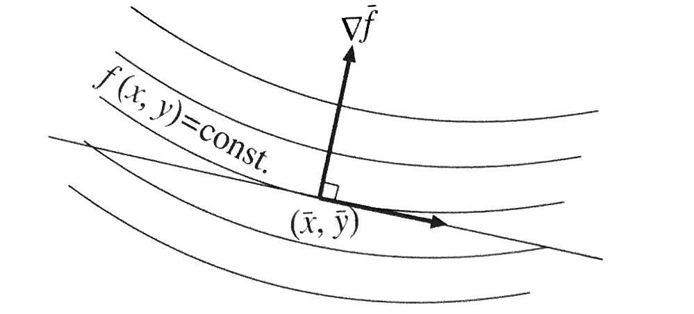

# 2.1 1次関数と2次関数
## 2.1.1 1次関数と勾配
$x,y$の1次関数
$$
f\left(x,y\right) = ax + by + c \quad (2.1)
$$
は$xy$面上の各点$\left(x, y\right)$に高さ$f\left(x,y\right)$を与えれば、$xyz$空間中の平面を表す。

$xy$面上を

 - $x$軸に平行な方向に距離1だけ進むと関数値は**$a$**だけ増える
    - $\frac {\partial f}{\partial x} = a$
 - $y$軸に平行な方向に距離1だけ進むと関数値は**$b$**だけ増える
    - $\frac {\partial f}{\partial y} = b$

すなわち,$x$軸、$y$軸方向への勾配の大きさがそれぞれ$a,b$である。これらを成分とするベクトル
$$
n=\left( \begin{matrix} { \partial f }/{ \partial x } \\ { \partial f }/{ \partial y } \end{matrix} \right) =\left( \begin{matrix} a \\ b \end{matrix} \right) \quad (2.2)
$$
を1次関数$f\left(x,y\right)$の**勾配(グランジエント)**と呼ぶ。

> 勾配$n$は**関数値が最も急激に増大する方向**を表し、そのノムル$\left\| n \right\| =\sqrt { { { a }_{ 1 } }^{ 2 }+{ { a }_{ 2 } }^{ 2 } } $は**その方向の増加率(単位長さ当たりの増加率)**を表す。

証明: 
$xy$面上のある点$\left( \bar { x } ,\bar { y }  \right) $から$x$軸、$y$軸方向へそれぞれ$\Delta x, \Delta y$だけ移動すると
$$
f\left(\bar {x} + \Delta x, \bar {y} + \Delta y\right) = a\left(\bar {x} + \Delta x\right) + b\left(\bar {y} + \Delta y\right) + c \quad (2.3)\\
f\left(\bar { x } ,\bar { y }\right) = a\bar {x} + b\bar {y} + c \quad (2.4)
$$
であるから、
$$
f\left(\bar {x} + \Delta x, \bar {y} + \Delta y\right) - f\left(\bar { x } ,\bar { y }\right) = a \Delta x + b \Delta y \quad (2.4)
$$
となる。
$$
\Delta f = f\left(\bar {x} + \Delta x, \bar {y} + \Delta y\right) - f\left(\bar { x } ,\bar { y }\right), \quad
\Delta x = \left( \begin{matrix} \Delta x \\ \Delta y \end{matrix} \right)
$$
と置くと、式(2.4)は
$$
\Delta f = n \cdot \Delta x \quad (2.6)
$$
と書ける。
ベクトル$\Delta x$のノムルを$\Delta s = \left\| \Delta x \right\| $とする。勾配$n$とベクトル$\Delta x$のなす角を$\theta$とすると、式(2.6)は次のように書き直せる。
$$
\Delta f = \left\| n \right\| \Delta s \cos { \theta } \quad (2.7)
$$
$ -1 \le \cos {\theta} \le 1$であるから、右辺が最大となるのは$\theta = 0$のときであり、そのとき$\Delta f = \left\| n \right\| \Delta s$となる。このことより、点$\left(\bar {x}, \bar {y}\right)$から一定の距離$\Delta s$だけ移動して関数値が最も急激に増大するのは勾配$n$の方向に移動するときであることがわかる。

 
 

**等高線**: 関数値が一定値をとる$xy$面上の点の軌跡

明らかに1次関数の等高線は直線であり、どの関数値に対する等高線も互いに平行である。式(2.7)から関数値が一定になる方向($\Delta f = 0$)は$\theta =\pi/2$のときである。したがって、**勾配は等高線に直交している**

> ### [定理2.1]
> 1次関数の等値面は平面であり、どの関数値に対する等値面も互いに平行である。そして勾配は等値面に直交する

 - **等値面**: $n$次元$x_{1}, \dots, x_{n}$空間中の関数値が一定値をとる曲面

---
# 2.2 関数の勾配と等高線
## 2.2.1 関数の勾配
$n$変数関数$f\left(x_{1}, \cdots, x_{n}\right)$を考える。これは$n$次元空間中に超曲面として表せる。

点$\left(\bar {x_{1}}, \cdots, \bar {x_{n}}\right)$でテイラー展開すると次のようになる。
$$
f\left(\bar {x_{1}}, \cdots, \bar {x_{n}}\right) = \bar {f} + \frac {\partial \bar {f}}{\partial x_{1}}\left(x_{1} - \bar {x_{1}}\right) + \cdots + \frac {\partial \bar {f}}{\partial x_{n}}\left(x_{n} - \bar {x_{n}}\right) + \cdots
$$

 - $\bar {f} = f\left(\bar {x_{1}}, \cdots, \bar {x_{n}}\right)$
 - $\partial \bar {f}/\partial x_{i}$: バーは点$\left(\bar {x_{1}}, \cdots, \bar {x_{n}}\right)$での値を表す

テイラー展開式の左辺の二つ目の$\cdots$は$\left(x_{i} - \bar {x_{i}}\right)$に関して2次以上の項であり、点$\left(x_{1}, \cdots, x_{n}\right)$が点$\left(\bar {x_{1}}, \cdots, \bar {x_{n}}\right)$に近いほど急速に小さくなる。そこで2次以上の項を無視した関数
$$
{ f }_{ 1  }\left( x_{ 1 },\dots ,x_{ n } \right) =\bar {f} + \frac {\partial \bar {f}}{\partial x_{1}}\left(x_{1} - \bar {x_{1}}\right) + \cdots + \frac {\partial \bar {f}}{\partial x_{n}}\left(x_{n} - \bar {x_{n}}\right) \quad (2.55)
$$
を**関数$f\left(x_{1}, \cdots, x_{n}\right)$の点$\left(\bar {x_{1}}, \cdots, \bar {x_{n}}\right)$における1次近似**と呼ぶ。この関数${ f }_{1}\left( x_{ 1 },\dots ,x_{ n } \right)$は1次関数であるから、$n$次元空間では超平面を表す。この関数$f\left(x_{1}, \cdots, x_{n}\right)$の**勾配(グランジエント)**を次のように定義する。
$$
\nabla f = \left( \begin{matrix} { \partial f }/{ \partial x_{ 1 } } \\ \vdots  \\ { \partial f }/{ \partial x_{ n } } \end{matrix} \right) \quad (2.56)
$$
このベクトルは**その点の近傍で関数値が最も急激に増大する方向**を指し、そのノムル$\left\| \nabla f \right\|$は**その方向の増加率**を表している。

## 2.2.2 関数の等高線
2変数関数$f\left(x, y\right)$を考える。

**等高線**: $xy$面上の関数値が一定($f\left(x,y\right)=const.$)の軌跡

点$\left(\bar {x}, \bar {y}\right)$での関数値を$c$とすると、点$\left(\bar {x}, \bar {y}\right)$は等高線$f\left(x,y\right)=c$上にある。点$\left(\bar {x}, \bar {y}\right)$の近くにあってその等高線の上にある点$\left(x,y\right)$を考える。$\Delta x = x - \bar {x}, \quad \Delta y = y - \bar {y}$と置くと$x = \bar {x} - \Delta x, \quad y = \bar {y} + \Delta y$であり、その点で$f\left(x,y\right) = c$が成立しているから、
$$
f\left(\bar {x} + \Delta x, \bar {y} + \Delta y\right) = c \quad (2.57)
$$ s
である。これを点$\left(\bar {x}, \bar {y}\right)$でテイラー展開すると
$$
f\left(\bar {x} + \Delta x, \bar {y} + \Delta y\right) = f\left(\bar {x}, \bar {y}\right) + \frac {\partial \bar {f}}{\partial x} \Delta x + \frac {\partial \bar {f}}{\partial y} \Delta y + \dots = c \quad (2.58)
$$
となる。$dots$は$\Delta x$と$\Delta y$に関して2次以上の項である。$f\left(\bar {x}, \bar {y}\right)=c$であるから
$$
\frac {\partial \bar {f}}{\partial x} \Delta x + \frac {\partial \bar {f}}{\partial y} \Delta y + \dots = 0 \quad (2.59)
$$
となる。

 - $\partial \bar {f}/\partial x, \partial \bar {f}/\partial y$: バーは点$\left(\bar {x}, \bar {y}\right)$での値を表す

$\Delta x, \Delta y$を成分とするベクトルを$\Delta x$とし、点$\left(\bar {x}, \bar {y}\right)$での勾配を$\nabla \bar {f}$と書くと、上式は
$$
\nabla \bar {f} \cdot \Delta x + \cdots = 0 \quad (2.60)
$$
と書ける。そして、$\Delta x$が小さいほど$\dots$は急速に小さくなる。このことは等高線$f\left(x, y\right) = c$が点$\left(\bar {x}, \bar {y}\right)$の近傍で勾配$\nabla \bar {f}$に**直交している**ことを意味する。

これはどの点でも成立するから、**勾配$\nabla f$はその点を通る等高線に直交する**。言い換えれば、**等高線$f\left(x, y\right) = c$の法線ベクトルは勾配$\nabla f$である**。以上のことは$n$変数関数でも成立する。

> ### [定理 2.5]
> 関数$f\left(x_{1}, \cdots, x_{n}\right)$の勾配$\nabla f$は等値面$f\left(x_{1}, \cdots, x_{n}\right) = const.$の法線ベクトルである。

式(2.59)で$\Delta x = x - \bar {x}, \quad \Delta y = y - \bar {y}$と置いて2次以上の項$\cdots$を無視すると
$$
\frac {\partial \bar {f}}{\partial x}\left(x - \bar {x}\right) + \frac {\partial \bar {f}}{\partial y}\left(y - \bar {y}\right) = 0 \quad (2.61)
$$
となる。 
点$(\bar {x}, bar {y})$を通り、ベクトル$\left( \begin{matrix} a \\ b \end{matrix} \right) $を法線とする直線の方程式は$a\left(x - \bar {x}\right) + b\left(y - \bar {y}\right) = 0$である(→1.1.3 曲線の接線)。ゆえに点$(\bar {x}, \bar {y})$を通り、$\nabla \bar {f}$を法線とする直線は式(2.61)で与えられる。

> ### [定理 2.6]
> 等値面$f\left(x_{1}, \cdots, x_{n}\right) = const.$の点$\left( \bar {x_{1}}, \cdots, \bar {x_{n}}\right)$における接平面の方程式は
> $$
> \frac {\partial \bar {f}}{\partial x_{1}}\left(x_{1} - \bar {x_{1}}\right) + \dots + \frac {\partial \bar {f}}{\partial x_{n}}\left(x_{n} - \bar {x_{n}}\right) = 0 \quad (2.62)
> $$
> である。接平面の法線ベクトルは$\nabla \bar {f}$である。
