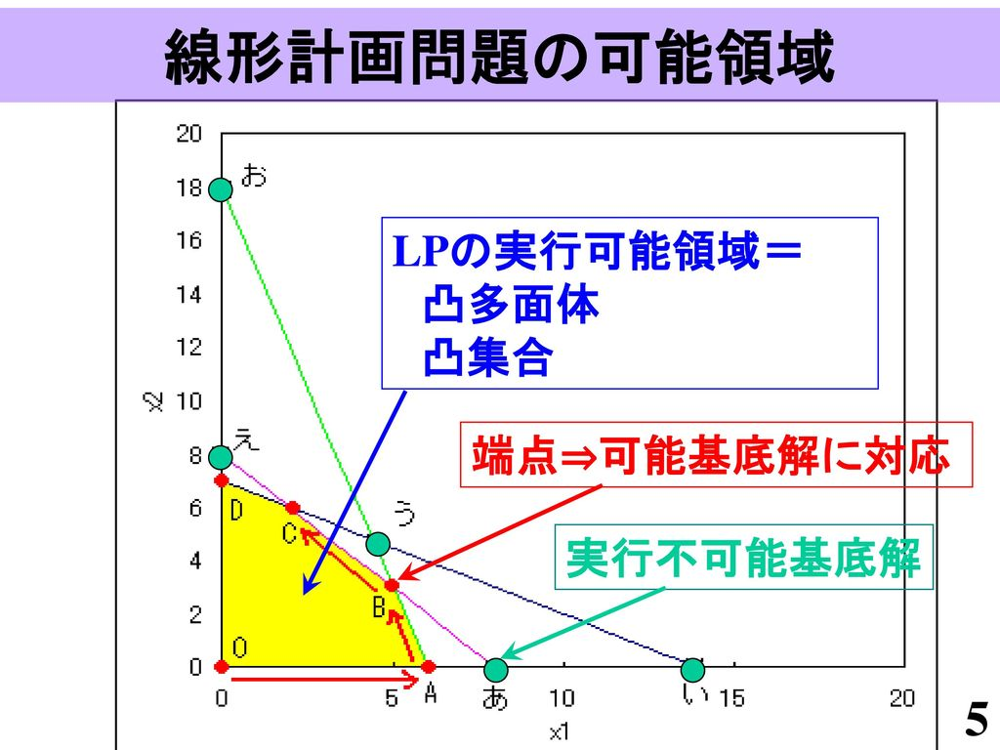
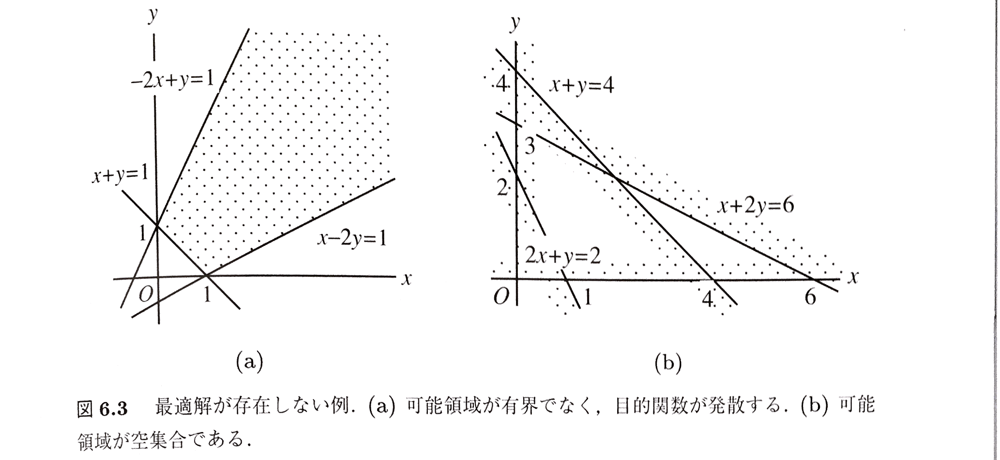
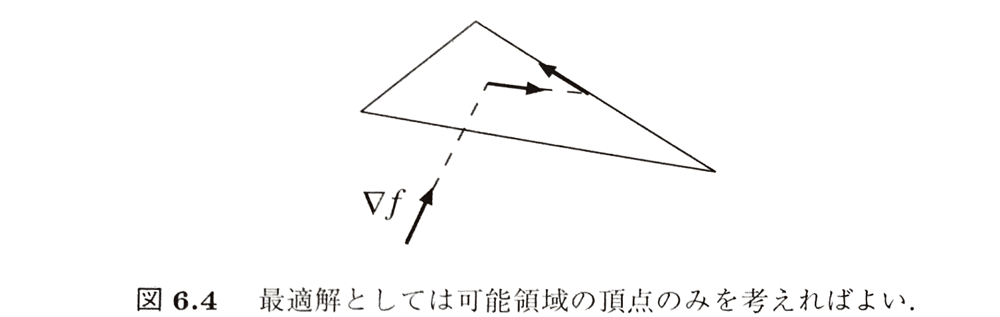

# 6.1 線形計画の標準形
次の形の最適化問題を考える。

> ### [問題P0]
> $$
> \begin{cases} { a }_{ 11 }{ x }_{ 1 }+{ a }_{ 12 }{ x }_{ 2 }+\cdots +{ a }_{ 1n }{ x }_{ n }\le { b }_{ 1 } \\ { a }_{ 21 }{ x }_{ 2 }+{ a }_{ 22 }{ x }_{ 2 }+\cdots +{ a }_{ 2n }{ x }_{ n }\le { b }_{ 2 } \\ \cdots  \\ { a }_{ m1 }{ x }_{ 1 }+{ a }_{ m2 }{ x }_{ 2 }+\cdots +{ a }_{ mn }{ x }_{ n }\le { b }_{ m } \end{cases}\quad (6.1)\\ { x }_{ 1 }\ge 0,\quad { x }_{ 2 }\ge 0,\quad \cdots ,\quad { x }_{ n }\ge 0\quad (6.2)
> $$
> $$
> \max { f={ c }_{ 1 }{ x }_{ 1 }+{ c }_{ 2 }{ x }_{ 2 }+\cdots +{ c }_{ n }{ x }_{ n } } \quad (6.3)
> $$

この問題の特徴は次の点である。

 - $n$個の変数$x_{1},\cdots, x_{n}$はすべて**非負**である
 - $m$個の制約条件は変数$x_{1},\cdots, x_{n}$の**1次式**の**不等式**(**制約不等式**)である
 - 最大化する関数$f$(**目的関数**)は変数$x_{1},\cdots, x_{n}$の**1次関数**である

この三つの特徴をもつ問題を**線形計画**と呼ぶ。そして、それを問題P0のようにしたものを線形計画の**標準形**と呼ぶ。線形計画を解く手法を**線形計画法**という。

**[例題 6.1]**

 - *ある工場では,$n$種類の製品$A_{1}, \cdots, A_{n}$を製造している*
 - *$n$種類の製品を作るには$m$種類の原料$M_{1}, \cdots, M_{m}$を用いる*
 - *製品$A_{j}$を作るには1単位当たり原料$M_{i}$を$a_{ij}$kg必要とする*
 - *工場には原料$M_{1}, \cdots, M_{m}$がそれぞれ$b_{1}kg,\cdots, b_{m}kg$ある*
 - *製品$A_{1}, \cdots, A_{n}$はそれぞれ1単位当たり$c_{1}$円,$\cdots, c_{n}$円で売れる*

*このとき、売上高を最大にするように製品$A_{1}, \cdots, A_{n}$を製造したい。このときの計画はどのように記述できるか。*

製品$A_{1}, \cdots, A_{n}$をそれぞれ$x_{1}$単位$, \cdots, x_{n}$単位作るとする。売上高を最大にするという式は
$$
\max { \pi ={ c }_{ 1 }{ x }_{ 1 }+{ c }_{ 2 }{ x }_{ 2 }+\cdots +{ c }_{ n }{ x }_{ n } }
$$
で表すことができ、条件(6.3)を得る。もちろん、すべての製品の生産単位$x_{1}, \cdots, x_{n}$は正またはゼロでなければならないので条件(6.2)
$$
{ x }_{ 1 }\ge 0,\quad { x }_{ 2 }\ge 0,\quad \cdots ,\quad { x }_{ n }\ge 0
$$
を得る。そして、原料$M_{1}$はそれぞれに対して$a_{11}x_{1}kg,\cdots,a_{1n}x_{n}kg$必要であり、その合計が$b_{1}kg$以下でなければならない。つまり
$$
{ a }_{ 11 }{ x }_{ 1 }+{ a }_{ 12 }{ x }_{ 2 }+\cdots +{ a }_{ 1n }{ x }_{ n } \le b_{j}
$$
を満たす。原料$M_{2},\cdots, M_{m}$についても同様にして残りの制約不等式が得られる。これで条件(6.1)が得られる。

---
# 6.2 可能領域

 - **可能領域**(または**許容領域**): $n$次元空間内で条件(6.1),(6.2)の不等式を満たす点$\left(x_{1}, \cdots, x_{n}\right)$の集合
 - **可能解**(または**許容解**): 可能領域に属する点$\left(x_{1}, \cdots, x_{n}\right)$
    - **最適解**: 可能解の中で目的関数を最大にする点$\left({x_{1}}^{\ast}, \cdots, {x_{n}}^{\ast}\right)$

このとき次の定理が成り立つ。

> ### [定理 6.1]
> 問題P0の可能領域は$n$次元空間内の**凸多面体(凸集合)**である

**[定理 6.1]の解説**:

2次元で考えるとわかりやすい。条件(6.2)は解が2次元空間の第1象限になければならないことを示している。2次元空間内の平面$a_{11}x_{1} + a_{12}x_{2} = b_{1}$は、2次元空間をこの面を境界とする$a_{11}x_{1} + a_{12}x_{2} > b_{1}$の側と$a_{11}x_{1} + a_{12}x_{2} < b_{1}$の側の二つの**半空間**に分割する。条件(6.1)の最初の不等式は、解がこの平面上または半空間$a_{11}x_{1} + a_{12}x_{2} < b_{1}$にあることを示している。残りの不等式についても、解がそれぞれの対応する平面上、またはその一方の側の半空間にあることを示している。

集合$S$に含まれる任意の点$u \in S, \quad v \in S$とスカラー$\theta \in \left[0,1\right]$に対して、$w = \theta u + (1-\theta)v \in S$が真であるので、集合$S$は凸集合である。

定理6.1より、最適解が存在しないのは次の二つの場合である。

 - 可能領域が有界ではなく、目的関数が発散する
    - ※どの方向にもある一定の距離$R$以内に制限されている(すなわち、半径$R$の(超)球に含まれる)集合を**有界である**といい、そうでないとき**有界でない**という。
 - 可能領域が空集合である

---
# 6.3 線形計画の基本定理

線形計画問題P0の解を求める最も基本的な原理:
> 目的関数$f$を最大にする最適解があるとすれば、可能領域を表す凸多面体の**頂点のみを調べればよい**

 1. $f$は1次関数であり、**1次関数は極値をとらない**→凸多面体の内部で極大値をとることはない
 2. $f$が定数関数でなければその勾配$\Delta f$は零ではないから、その方向に進めば$f$の値が単調に増大し、最適解があるとすればついにはどこかの**境界面に達する**&$f$が定数であれば、どこでも値が同じであるから、**境界面上の値のみを考えればよい**
    - 
 3. その境界面上でも$f$は1次関数であるから内部で極値をとることはない
    - 面上で定数でなければ、ある方向に進めと関数値が増えるから、最適解があるとすればついにはその面のある**辺に達する**
    - 面上で定数であれば、どこでも値が同じであるから、**辺上の値のみを考えればよい**
    - 
 4. その辺でも$f$は1次関数であるから、内部で極値をとることはない
    - 辺上で定数でなければ、どちらかの方向に進むと関数値が増えるから、最適解があるとすればついにはその**端点に達する**
    - 辺上で定数であれば、どこでも値が同じであるから、**端点の値のみ考えればよい**

上記のことは何次元の多面体でも同じであるから、次の線形計画の基本定理を得る。

> ### [定理 6.2]
> 問題P0に最適解$({x_{1}}^{\ast}, \cdots, {x_{n}}^{\ast})$が存在すれば、目的関数は可能領域の頂点で最大値をとる

問題P0の最適解は、可能領域のうち各境界面上であるため条件(6.1),(6.2)の不等式を**等号に置き換えたもの**のどれかである。このことから、次の結論を得る。

> ### [定理 6.3]
> 問題P0のある最適解$({x_{1}}^{\ast}, \cdots, {x_{n}}^{\ast})$において、条件(6.1),(6.2)の$m+n$個の不等式のうち$n$個が等号で成立する

よって、問題P0は原理的には次のようにして解くことができる

 1. 条件(6.1),(6.2)の$m + n$個の不等式のうちから$n$個を選んで等号に置き換えた連立1次方程式を解く
 2. その解が非負であって、残りの制約不等式を満たすか調べる
 3. 満たせば目的関数$f$の値を計算する
 4. これをすべての可能性について行い、$f$の値が最大になるものを選ぶ

しかし、$m+n$個の不等式から$n$個を選ぶ選び方は${ _{ m+n }{ C }_{ n } }=\cfrac { (m+n)! }{ n!(m!) }$の数だけある。これらの不等式をなるべく早く最適解を到達するように、組織的に$n$個を選ぶ方法を考える

---
# 6.4 スラック変数

不等式は**小さいほうの辺(問題P0の条件(6.1)でいうと左辺)**に非負の数を加えて等式にすることができる。

**スラック変数**: 小さいほうの辺に付け加える非負の変数

問題P0の条件(6.1)の制約不等式にスラック変数$\lambda_{1}, \cdots, \lambda_{n}$を導入して等式の制約条件に書き換えると、問題P0は次の問題P1と等価になる。

> ### [問題P1]
>$$
>\begin{cases} { a }_{ 11 }{ x }_{ 1 }+{ a }_{ 12 }{ x }_{ 2 }+\cdots +{ a }_{ 1n }{ x }_{ n }+{ \lambda  }_{ 1 }={ b }_{ 1 } \\ { a }_{ 21 }{ x }_{ 2 }+{ a }_{ 22 }{ x }_{ 2 }+\cdots +{ a }_{ 2n }{ x }_{ n }+{ \lambda  }_{ 2 }={ b }_{ 2 } \\ \cdots  \\ { a }_{ m1 }{ x }_{ 1 }+{ a }_{ m2 }{ x }_{ 2 }+\cdots +{ a }_{ mn }{ x }_{ n }+{ \lambda  }_{ m }={ b }_{ m } \end{cases}\quad (6.26)\\ { x }_{ 1 }\ge 0,\quad { x }_{ 2 }\ge 0,\quad \cdots ,\quad { x }_{ n }\ge 0\\ { \lambda  }_{ 1 }\ge 0,\quad { \lambda  }_{ 2 }\ge 0,\quad \cdots ,\quad { \lambda  }_{ m }\ge 0\quad (6.27)
>$$
> $$
> \max { f={ c }_{ 1 }{ x }_{ 1 }+{ c }_{ 2 }{ x }_{ 2 }+\cdots +{ c }_{ n }{ x }_{ n } } \quad (6.28)
> $$

> ### [定理 6.4]
> 問題P1のある最適解$({x_{1}}^{\ast}, \cdots, {x_{n}}^{\ast}, {\lambda_{1}}^{\ast}, \cdots, {\lambda_{m}}^{\ast})$において、$n + m$個の値${x_{1}}^{\ast}, \cdots, {x_{n}}^{\ast}, {\lambda_{1}}^{\ast}, \cdots, {\lambda_{n}}^{\ast}$のうちの$n$個は0である

---
# 6.5 シンプレックス法
## 6.5.1 原理と計算法

## 6.5.2 幾何学的解釈

---
# 6.6 退化

---
# 6.7 人工変数

---
# 6.8 双対原理
## 6.8.1 双対問題と双対変数

## 6.8.2 双対定理

## 6.8.3 スラック変数と双対変数

## 6.8.4 双対変数の解釈
