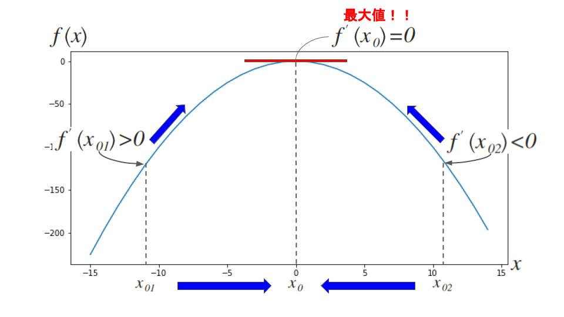
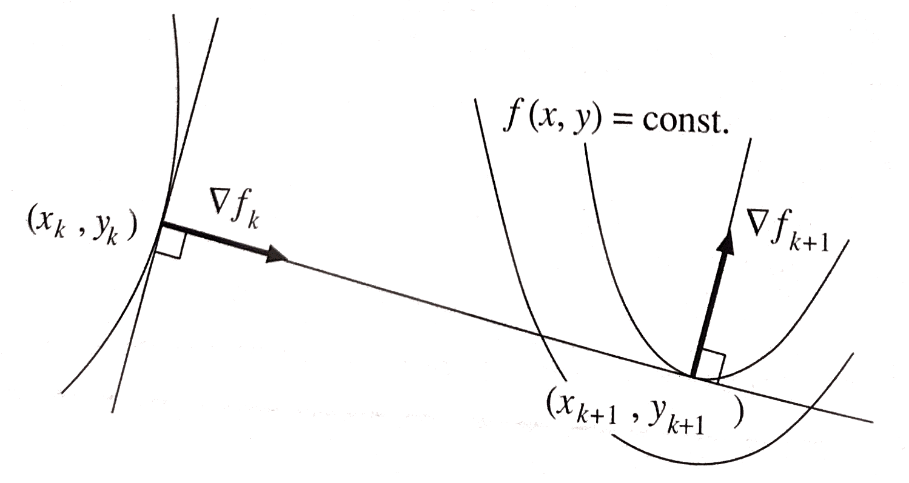

# 関数の最適化

一般の多変数関数の極値を数値的に計算する代表的な手法を紹介する。これらはどれも、その関数の定義域に与えた初期位置から関数が増大または減少する方向を探索し、その方向に移動して、これを収束するまで繰り返すという反復解法である。

 - **最適化** : 与えられた制約条件のもとで関数の値を最大または最小にする変数の値を求めること
 - ※本ドキュメントでは、制約条件が与えられていない場合を考える

---
# 3.1 勾配法

> - 関数$f\left( x \right)$の最大値を計算する方法を考える
> - 解析的に最大値を計算するには方程式$f^{\prime}\left( x \right) = 0$の解を求める必要がある
> - しかし、**導関数$f^{\prime}\left( x \right)$が複雑な関数の場合は解析的に解が求まらない**ことが多い
> - このとき、「**関数$f\left( x \right)$は考えている領域で$f^{\prime}\left( x \right) = 0$となる$x$が一つしかない**」ということがわかっているなら、次の勾配法を用いて数値的に計算できる

## 1変数の場合

### ステップ1) 初期値の設定
最大値をとる点に近いと思われる点$x_{0}$を**初期値**として与える。

 - $f^{\prime}\left( x_{0} \right) > 0$なら$x$軸上を右に進む
 - $f^{\prime}\left( x_{0} \right) < 0$なら$x$軸上を左に進む

	<b>問題 : どのくらいの距離進む？？？</b>
	<table>
		<tr>
			<td>
				
				
進みすぎると最大値をとる点を通り越して 関数値が減少してしまう恐れも

			</td>
			<td>
				
				
進み方が小さいとなかなか最大値をとる点に 到達しない

			</td>
		</tr>
	</table>
	
進むステップ幅は<u><b>関数値が必ず増加するように</b></u>かつ<u><b>なるべく大きく</b></u>とる適切な幅にする！！！

### ステップ2) 初期更新

以下では、最大化問題を前提にして、初期値$x_{0}$がそれぞれ$f^{\prime}\left( x_{0} \right) > 0$,$f^{\prime}\left( x_{0} \right) < 0$の場合について考える。

<table>
	<tr>
		<th>$f^{\prime}\left( x_{0} \right) > 0$なら</th>
		<th>$f^{\prime}\left( x_{0} \right) < 0$なら</th>
	</tr>
	<tr>
		<td>
			
一定値$h$だけ進んだ点$x_{0} + h$を調べる

			
		</td>
		<td>
			
一定値$-h$だけ進んだ点$x_{0} - h$を調べる

			
		</td>
	</tr>
</table>

### ステップ3) $f\left( x_{0} \right)$より大きくなる点の探索

初期値から更新された点$x_{0} \pm h$の関数値$f\left( x_{0} \pm h \right)$がより大きければ...

	$f\left( x_{0} \pm h \right) > f\left( x_{0} \right)$

 1. **更新)** さらに$2h$だけ進む.そこでの関数値がより大きければさらに$4h$だけ進む・・・という具合に関数値が増加し続ける限り、ステップ幅を倍倍にしていく.
 2. **停止)** 増加が止まったらその直前で停止して、そこを次の位置$x_{1}$とする.

<table>
	<tr>
		<th></th>
		<th>$f^{\prime}\left( x_{0} \right) > 0$なら</th>
		<th>$f^{\prime}\left( x_{0} \right) < 0$なら</th>
	</tr>
	<tr>
		<td>更新</td>
		<td></td>
		<td></td>
	</tr>
	<tr>
		<td>停止</td>
		<td></td>
		<td></td>
	</tr>
</table>

 

一方、点$x_{0} \pm h$での値が$f\left(x_{0} \right)$より小さければ...

	$f\left( x_{0} \pm h \right) < f\left( x_{0} \right)$ 
	

 1. **更新)** 点$x_{0} + h/2$を調べる.その点での関数値がより小さければ点$x_{0} + h/4$を調べ・・・という具合にステップ幅を半分半分にしていく.
 2. **停止)** $f\left( x_{0} \right)$より大きい値が見つかれば、そこを次の位置$x_{1}$とする.

### ステップ4)
上記のステップを実施することで、ついには$f\left( x_{0} \right)$より大きな値$f\left( x_{1} \right)$が見つかる.このようにして関数値が増加した次の点$x_{1}$が求まったら、その直前のステップ幅を$h$として改めて同じことを行い、数列$x_{0}, x_{1}, x_{2}, \dots$を計算し、$f^{\prime}\left( x_{t} \right) \approx 0$となるまで繰り返す.

### 1変数のアルゴリズム
Algorithm:  search $\max _{x}{f\left( x \right)}$

 - $\mathrm {sgn}$ : **符号関数**.
 	- $x > 0$なら$\mathrm {sgn}\left( x \right) = 1$
 	- $x < 0$なら$\mathrm {sgn}\left( x \right) = -1$

$\mathrm {input} : x_{0}, h, f\left(x \right), f^{\prime}\left( x \right), \epsilon$ 
 

$\mathrm {while}$ 

$\quad h \leftarrow \mathrm {sgn}\left( f^{\prime}\left(x\right) \right) \left| h \right|$ 
$\quad X \leftarrow x$ 
$\quad X^{\prime} \leftarrow x + h$ 

$\quad \mathrm {if}$ $f\left( \mathrm {X} \right) < f\left( \mathrm {X}^{\prime} \right)$ 
$\quad \quad \mathrm {while}$ $f\left( X \right) \ge f\left( X^{\prime} \right)$ 

$\quad \quad \quad h \leftarrow 2h$ 
$\quad \quad \quad X \leftarrow X^{\prime}$ 
$\quad \quad \quad X^{\prime} \leftarrow X + h$ 

$\quad \quad \mathrm {endwhile}$ 
$\quad \quad x \leftarrow X$ 
$\quad \quad h \leftarrow h/2$ 
$\quad \mathrm {else}$ 
$\quad \quad \mathrm {while}$ $f\left( X \right) \le f\left( X^{\prime} \right)$ 

$\quad \quad \quad h \leftarrow \cfrac {h}{2}$ 
$\quad \quad \quad X^{\prime} \leftarrow X^{\prime} - h$ 

$\quad \quad \mathrm {endwhile}$ 

$\quad \quad x \leftarrow X^{\prime}$ 
$\quad \quad h \leftarrow 2h$ 

$\quad \mathrm {end if}$ 

$\quad \mathrm {if} \quad \left| f^{\prime}\left( x \right) \right| \le \epsilon \quad break$ 
$\mathrm {end while}$

 
$\mathrm {output} : x_{t}$

## 多変数の場合

 1. 最大値をとる点に近いと思われる点$\boldsymbol { \mathrm {x} } = \left( x_{10}, \dots, x_{p0} \right)$を**初期値**として与える.
 2. 関数値が最も大きく増大する方向は勾配$\nabla f = \left( \cfrac {\partial f}{\partial x_{1}}, \dots, \cfrac {\partial f}{\partial x_{p}} \right)$で与えられるので、その方向の直線上で関数値が最大になる点まで進む・・・ということを収束するまで繰り返す

※最小値を求めるには$-f\left( x_{1}, \dots, x_{p} \right)$の最大値を求めればよい.

### 多変数のアルゴリズム
Algorithm : search $\boldsymbol {\mathrm {x}}_{max} = arg \max _{\boldsymbol {\mathrm {x}}}{f\left( \boldsymbol {\mathrm {x}} \right)}$

$\mathrm {input} : f\left( \boldsymbol {\mathrm {x}} \right), \nabla f$ 

$\boldsymbol {\mathrm {x}} \leftarrow \boldsymbol {\mathrm {x}}_{0}$ 

$\mathrm {output} : \boldsymbol {\mathrm {x}}_{max}$

## 勾配法の欠点

 1. 勾配$\nabla f$を式として与える必要があるから、微分できない関数では都合が悪い.(例えば不連続があったり、とがったりしている.)また、理論的には微分可能であっても複雑すぎる、あるいは変数の数が数百もしくは数千あって、勾配を式として書くのが難しい場合も適用できない.
 2. 絶対的最大値、絶対的最小値以外の極値（相対的最大値、相対的最小値）もしくは変曲点が存在すれば、初期値の与え方によっては最大値、最小値でない極値に到達してしまう可能性もある.したがって、計算を開始するためには、最大値または最小値をとる点に十分近い初期値が推定できなければならない.
 3. たとえ極値が一つしかないとしても、その極値付近の関数形によっては、なかなかその点に近づかないことが起こる.これは極値が細長い尾根の上や細長い谷の底にあるときに生じやすい

---
# 3.2 ニュートン法

 - 1階導関数だけでなく2階導関数も計算できるなら、勾配法より効率的なアルゴリズム

## 1変数の場合

$x$軸上の点$\bar {x}$の近くの点$\bar {x} + \Delta x$での関数$f\left( x \right)$の値はテイラー展開して

## 多変数の場合

## ニュートン法の収束

---
# 参考文献

 - 金谷健一[2005]『これなら分かる最適化数学 - 基礎原理から計算手法まで -』「第3章 関数の最適化」共立出版株式会社