# 線形計画モデル
線形計画モデルの構築手順

 1. 当面する問題を明確に定義する: その**目的**、**代替行動**、**制約**などをはっきり示す必要がある
 2. 1.の定義に従って数学モデルを構成(定式化)する
    1. 決定すべき未知の変数(独立変数、説明変数)を明確にし、それらにわかりやすい名前や記号を割り当てる
    2. 最大化または最小化するための目的関数(objective function)を定式化する
    3. その問題のすべての制限や制約(constraints)を定式化する

線形計画モデルは、これらの式がすべて**1次式**で表されるもので、その取り扱いの容易さから広く利用されている。

> **最大化問題**(maximization problem)
> $$
>\max { \quad z={ c }_{ 1 }{ x }_{ 1 }+{ c }_{ 2 }{ x }_{ 2 }+\cdots +{ c }_{ n }{ x }_{ n } } \\ s.t.\begin{cases} { a }_{ 11 }{ x }_{ 1 }+{ a }_{ 12 }{ x }_{ 2 }+\cdots +{ a }_{ 1n }{ x }_{ n }\le { b }_{ 1 } \\ { a }_{ 21 }{ x }_{ 2 }+{ a }_{ 22 }{ x }_{ 2 }+\cdots +{ a }_{ 2n }{ x }_{ n }\le { b }_{ 2 } \\ \cdots  \\ { a }_{ m1 }{ x }_{ 1 }+{ a }_{ m2 }{ x }_{ 2 }+\cdots +{ a }_{ mn }{ x }_{ n }\le { b }_{ m } \end{cases}\\ { x }_{ 1 },{ x }_{ 2 },\cdots ,{ x }_{ n }\ge 0
> $$

 

> **最小化問題**(minimization problem)
> $$
> \min { \quad z={ c }_{ 1 }{ x }_{ 1 }+{ c }_{ 2 }{ x }_{ 2 }+\cdots +{ c }_{ n }{ x }_{ n } } \\ s.t.\begin{cases} { a }_{ 11 }{ x }_{ 1 }+{ a }_{ 12 }{ x }_{ 2 }+\cdots +{ a }_{ 1n }{ x }_{ n }\ge { b }_{ 1 } \\ { a }_{ 21 }{ x }_{ 2 }+{ a }_{ 22 }{ x }_{ 2 }+\cdots +{ a }_{ 2n }{ x }_{ n }\ge { b }_{ 2 } \\ \cdots  \\ { a }_{ m1 }{ x }_{ 1 }+{ a }_{ m2 }{ x }_{ 2 }+\cdots +{ a }_{ mn }{ x }_{ n }\ge { b }_{ m } \end{cases}\\ { x }_{ 1 },{ x }_{ 2 },\cdots ,{ x }_{ n }\ge 0
> $$

## 1. 実行可能領域

 - **実行可能領域**(feasible region): LPモデルの制約条件のような不等式をすべて満たす点の集合
 - **実行可能解**(feasible solution; 可能解、許容解): 実行可能領域に含まれる点
 - **最適解**: 実行可能解のなかで、目的関数の値を最大(最小化問題では最小)にするもの
 - **実行不能解**(infeasible solution; 不能解): 制約条件をすべて満たすことができない解のこと

ここで、次のような最大化問題を考える。この制約条件の実行可能領域は下の図のようになる。
> $$
> \max {\quad z = 10x_{1} + 15x_{2}}\\
> s.t. \quad x_{1} + 4x_{2} \le 300\\
> \quad x_{1} + x_{2} \le 150\\
> \quad x_{1},x_{2} \ge 0
> $$

| 制約条件の実行可能領域 | 線形計画モデルの図示 |
|:-----------------------------------------:|:-----------------------------------------:|
||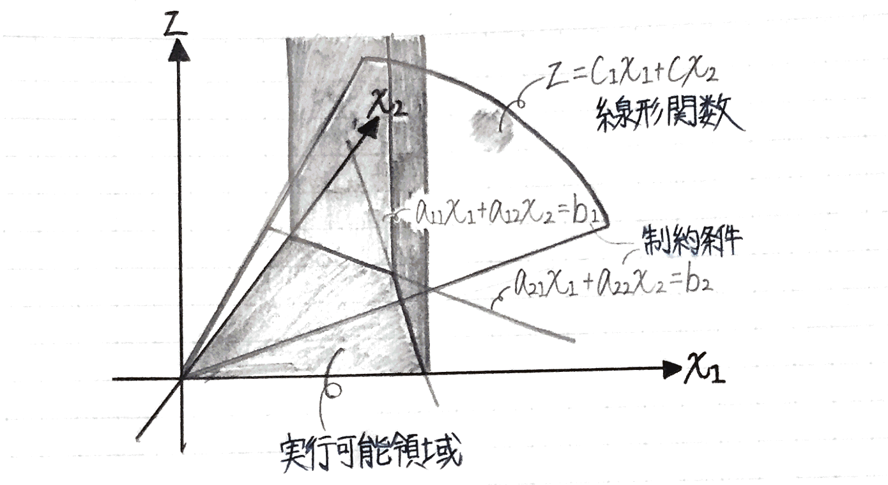|

上記の制約条件では２つの変数しかないので、実行可能領域は2次元となるが、$n$変数をもつ場合には$n$次元の**凸多面体(=凸集合)**(convex polyhedron)となる。

このことから、次の定理が得られる。

> ### 【定理2.1】
> LPモデルの実行可能領域は、$n$次元空間内の凸多面体(凸集合)である

しかし、最適解が存在しない場合もある。

**非有界の問題** 
つぎのような線形計画モデルの制約条件の実行可能領域がどのようになるのかを考える。

$$
\min {\quad z = 400x_{1} + 700x_{2}}\\
s.t. \quad 30x_{1}+ 20x_{2} \ge 20\\
\quad 20x_{1} + 40x_{2} \ge 100\\
\quad 5x_{1} + 25x_{2} \ge 50\\
x_{1},x_{2} \ge 0
$$
この場合の実行可能領域を図示すると、下の図のようになる。

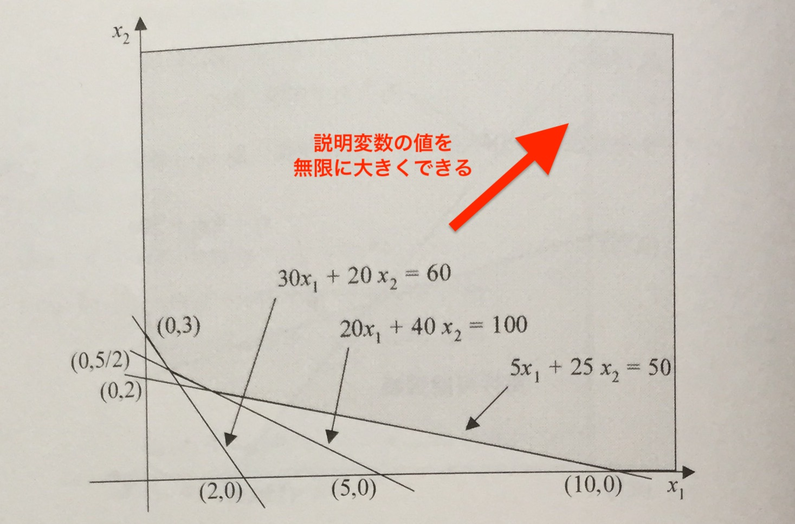

ここで注意しなければならないことは、制約条件を満たす実行可能領域が有界ではない、つまり閉じていないことである。このような実行可能領域のことを一般に非有界(unbounded)という。

上の図のような閉じていない実行可能領域を線形計画法の立場からみた場合、説明変数の値を無限に大きくできるため、問題によってはその目的関数値がいくらでも大きくなったり小さくなったりする可能性があり、最適解を特定できないということになる。したがって、線形計画法ではこのような問題を非有界の問題と呼び、最適解が存在しないとしている。

**実行不能な問題** 
つぎに最初から実行可能領域がない場合を考える。例えば、つぎのような制約条件を考える。
$$
s.t. \quad x_{1} + x_{2} \le 2\\
\quad x_{1} + x_{2} \ge 6\\
\quad x_{1},x_{2} \ge 0
$$
この領域を図示すると、以下の図のようになり共通領域が存在しない。

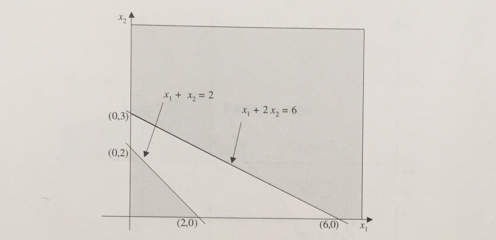

したがって、すべての制約式を満たすことができないため、実行可能解が存在せず、最適解もないことになる。線形計画法ではこのような問題のことを実行不能(infeasible)な問題という。

> このことから、線形計画問題が最適解をもたないのはつぎの場合である。
>
> 1. 実行可能領域が非有界で、目的関数が発散する
> 2. 実行可能領域が存在しない

 

また、以下のことも見当が付く。

> ### 【定理2.2】
> 与えられた線形計画問題に最適解が存在すれば、目的関数は実行可能領域の境界上または頂点(vertex)で最適値をとる

$n$次元多面体の頂点では、$n$個の境界面が交わっている。実行可能領域の各境界面は、線形計画モデルの$n + m$個の不等式を等号に置き変えたもの(つまり、等式に直したもの)のどれかと考えることができる。

## 図式解法
ここでは、線形計画法の幾何学的な理解を深めるために、グラフを用いて線形計画問題を解く図式解法(graphical solution)を示す。この解法は図を使うため3変数つまり、3次元に限定される。

つぎのような2変数を伴う生産計画問題を図式解法で解くことにする。
$$
\max {\quad z = 10x_{1} + 15x_{2}}\\
s.t. \quad x_{1} + 4x_{2} \le 300\\
\quad x_{1} + x_{2} \le 150\\
\quad x_{1},x_{2} \ge 0
$$

|  |  |
|:----------------------------------:|:----------------------------------:|
| 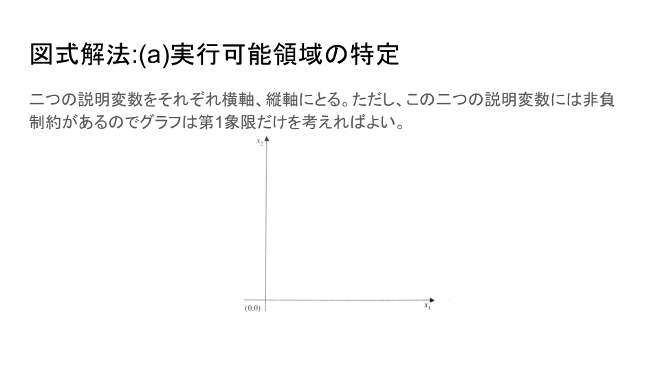 | 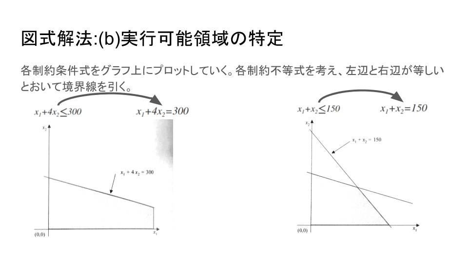 |
| 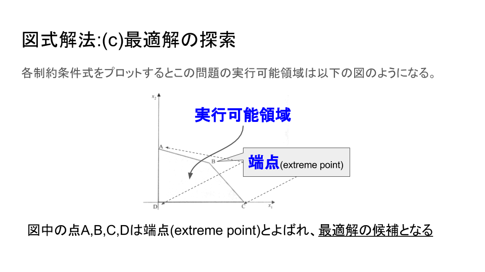 | 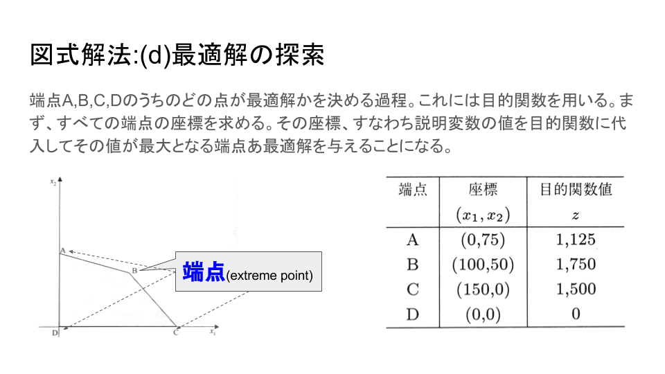 |

ただし、上述の方法はすべての端点を調べてその目的関数値を計算するため、制約式の数が増えて端点の数が多くなると時間がかかることになる。そこで、グラフ上でより効率的に最適解を見つける方法を示す。

### レベルカーブを用いた図式解法
この方法では、実行可能領域を特定するまでは上述の方法と同じである。その後、レベルカーブ(level curve)と呼ばれる等しい目的関数値をもつ等価線分を用いる。以下では、図式解法で用いた2変数を伴う生産計画問題を扱うものとする。

具体的には、

 1. 目的関数値が等しくなる等価線分をプロットする。
 2. レベルカーブは原点から離れると目的関数の値が大きくなり、逆に近付くと小さくなる性質(ただし、最小化問題で目的関数が負の係数を持っている場合は当てはまらない)のがあるので、この最大化問題では、下の図に示すように実行可能領域の境界に達するまで原点から遠ざけるように平行移動する。そのとき、レベルカーブが最後に接する点(あるいは線や面)が最適解である。

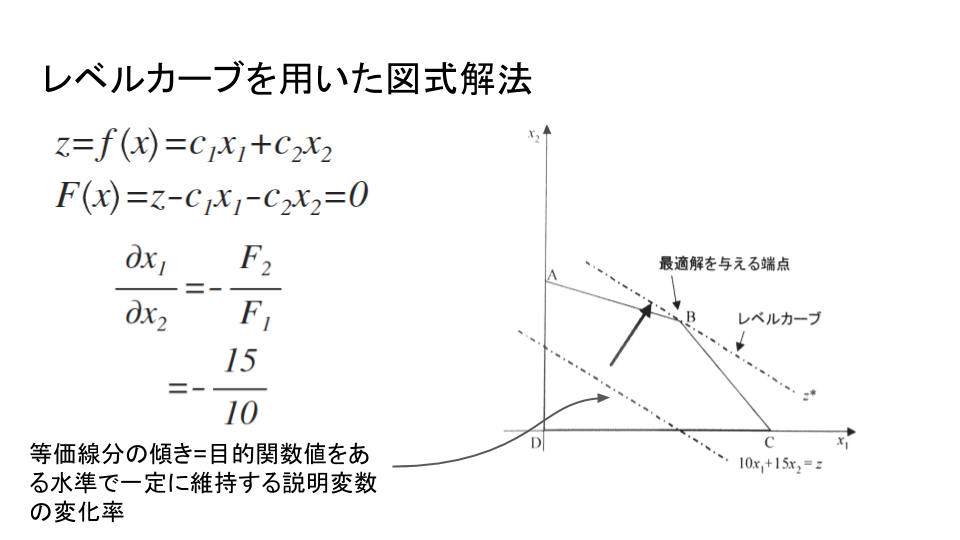

> (例: 献立問題)
>
> 最小化問題の例として、次の献立問題を取り上げる。
> $$
> \min {\quad z = 400x_{1} + 700x_{2}}\\
> s.t. \quad 30x_{1} + 20x_{2} \ge 60\\
> \quad 20x_{1} + 40x_{2} \ge 100\\
> \quad 5x_{1} + 25x_{2} \ge 50\\
> \quad x_{1},x_{2} \ge 0
> $$
> この献立問題の実行可能領域は非有界であり、説明変数$x_{1},x_{2}$のどちらお無限大まで増加できるということである。ただし、この問題は最小化問題であり、しかも目的関数の係数はどちらも非負であるので、説明変数が無限大の値をとる場合を考える必要はない。したがって、最適解の候補としては、端点A,B,C,Dとなる。

| 実行可能領域(レベルカーブ付き) | 線形計画モデル | 解の候補 |
|:----------:|:------------:|:------------:|
| 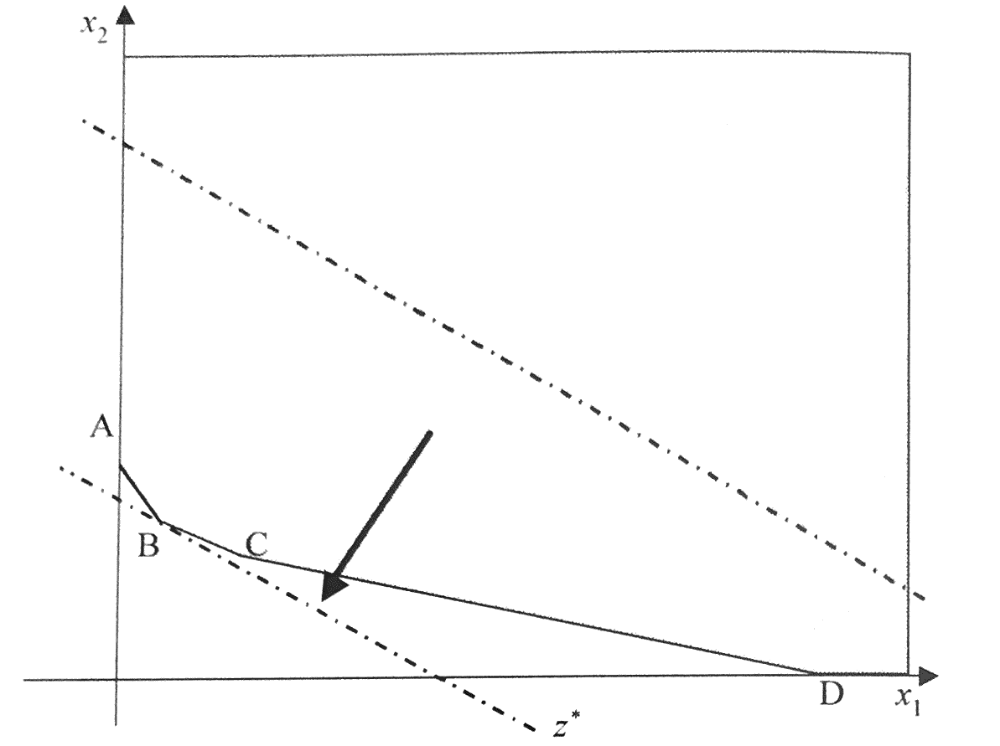 | 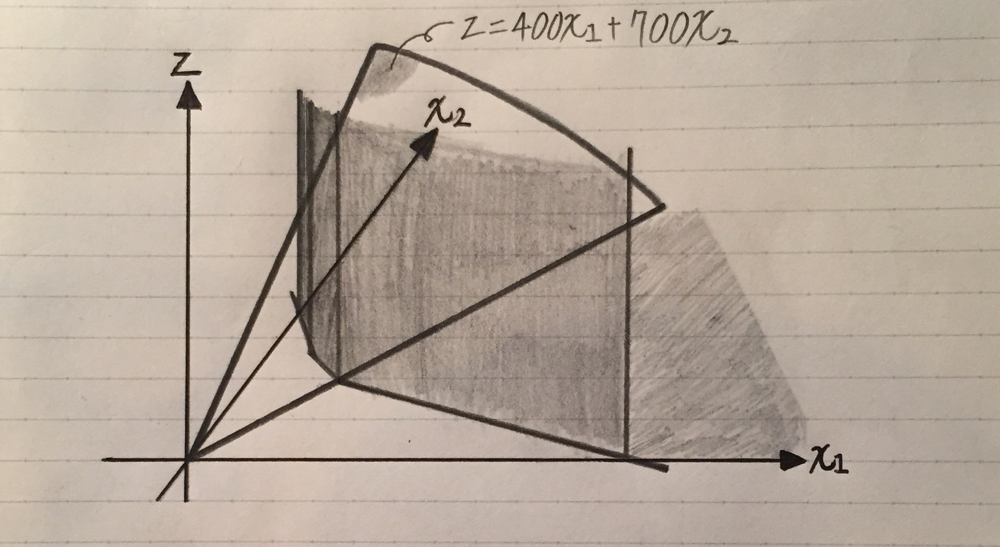 | 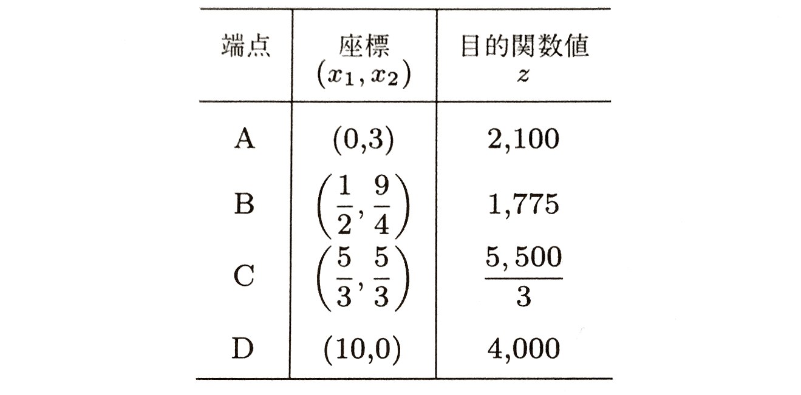 |

 

> ### 線形計画問題を解く図式解法の計算手順
>
> 1. **[座標系の定義]**: グラフ上に座標軸を描き、各軸に説明変数を割り当てる
> 2. **[制約条件のプロット]**: 各制約条件式に対し、等式の場合には直線、不等式の場合には領域を描く。
> 3. **[実行可能領域の特定]**: 2.で描かれたすべての領域の共通領域がこの問題のすべての制約条件を満足する点の集合、すなわち実行可能領域となる。この実行可能領域が空、すなわち存在しない場合は、制約条件をすべて満たす解が存在しないので、実行不能な問題として終了する。
> 4. **[目的関数のプロット]**: 目的関数の傾きを調べ、実行可能領域内の任意の場所に目的関数の等価線分(レベルカーブ)を書き込む
> 5. **[最適解の特定]**:
>       - 最大化問題: 実行可能領域の境界に達するまで原点から遠ざけるようレベルカーブを平行移動することにより、最適解をみつける
>       - 最小化問題: 原点に近づけるように平行移動することによって最適解をみつける

## 特殊な例
**非有界な問題の例(最適解が存在しないケース)** 
上述した献立問題を考える。この問題の実行可能領域は非有界であり、説明変数はともに無限大の値をもつことができる。もしこの問題が最小化問題ではなく最大化問題だった場合は、つまり

> $$
> \max {\quad z = 400x_{1} + 700x_{2}}\\
> s.t. \quad 30x_{1} + 20x_{2} \ge 60\\
> \quad 20x_{1} + 40x_{2} \ge 100\\
> \quad 5x_{1} + 25x_{2} \ge 50\\
> \quad x_{1},x_{2} \ge 0
> $$

の場合は、目的関数の値は限りなく大きくできることになる。したがって、最大値を特定できないため、この問題に最適解は存在しない。

**実行不能な問題の例(最適解が存在しないケース)** 
次のような問題を考える。
$$
\min {\quad z = 2x_{1} + x_{2}}\\
s.t. \quad x_{1} + x_{2} \le 2\\
\quad x_{1} + 2x_{2} \ge 6\\
\quad x_{1},x_{2} \ge 0
$$
この実行可能領域を図示すると以下の図になり、共通領域が存在しない。
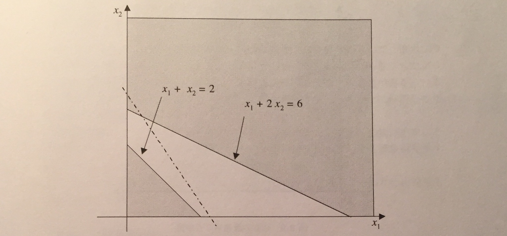

したがって、すべての制約式を満たすことができないため、実行可能解が存在せず、最適解もないことになる。このような問題を実行不能な問題という。

**複数の最適解をもつ問題の例** 
複数の最適解が存在する場合を説明するために、次のような生産計画問題を考える。

$$
\max {\quad z = 5x_{1} + 20x_{2}}\\
s.t. \quad x_{1} + 4x_{2} \le 300\\
\quad x_{1} + x_{2} \le 150\\
\quad x_{1},x_{2} \ge 0
$$

この制約条件式の実行可能領域にレベルカーブをプロットすると下の図になる。
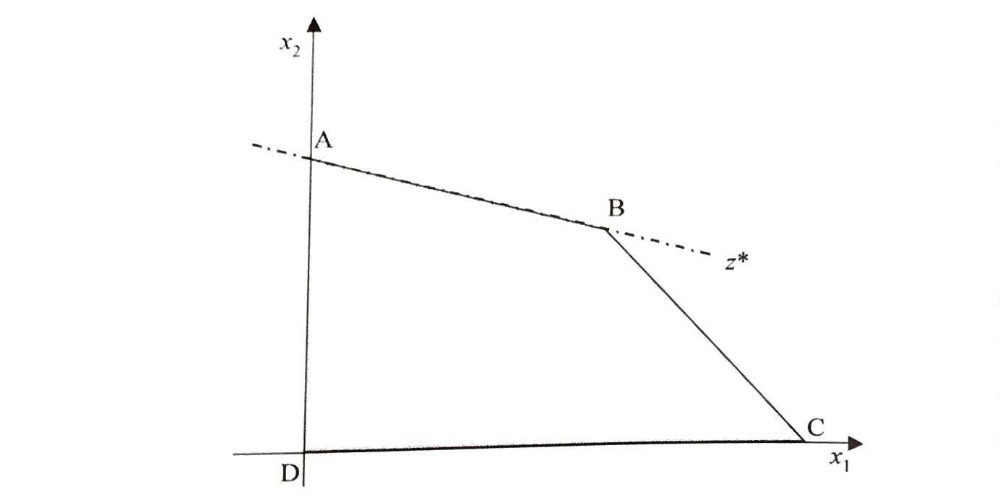
上の図のように、端点A,Bはともに最適解ということになり、常に一つとはかぎらず、複数存在する場合もある。

複数の最適解をもつケースは、図からも明らかなように、目的関数のレベルカーブの傾きと実行可能領域を形成している制約式に対応する線分の傾きが一致する場合に発生する。

**退化の例** 
WIP

---
# シンプレックス法
線形計画問題の汎用解法としてもっともよく知られているシンプレックス法を取り上げ、その基礎となる基本定理や解の収束性などについて示す。

## 標準形の線形計画問題
線形計画問題を汎用性の高い手法を用いて解く場合、不等式制約でなく等式制約として扱うほうが便利なことが多い。したがって、不等式制約をもつ線形計画問題を何らかの変換を用いて次のような1次の等式制約と非負条件をもつ問題に変換して扱われることになる。

$$
\max  /\min  \quad z=c_{ 1 }x_{ 1 }+c_{ 2 }x_{ 2 }+\cdots +c_{ n }x_{ n }\\ s.t.\begin{cases} { a }_{ 11 }{ x }_{ 1 }+{ a }_{ 12 }{ x }_{ 2 }+\cdots +{ a }_{ 1n }{ x }_{ n }={ b }_{ 1 } \\ { a }_{ 21 }{ x }_{ 1 }+{ a }_{ 22 }{ x }_{ 2 }+\cdots +{ a }_{ 2n }{ x }_{ n }={ b }_{ 2 } \\ \vdots  \\ { a }_{ m1 }{ x }_{ 1 }+{ a }_{ m2 }{ x }_{ 2 }+\cdots +{ a }_{ mn }{ x }_{ n }={ b }_{ m } \end{cases}\\ \qquad { x }_{ 1 },{ x }_{ 2 },\dots ,{ x }_{ n }\ge 0
$$

線形計画では、このような形式をもつ問題を**標準形**(standard form)の線形計画モデルという。これに対して、不等式制約をもつ線形計画問題のことを**一般形**の線形計画モデルとよぶこともある。

一般形から標準形への変換は、補助変数を用いて容易に行うことができる。例えば、以下の最大化問題
$$
\max { \quad z=c_{ 1 }x_{ 1 }+c_{ 2 }x_{ 2 }+\cdots +c_{ n }x_{ n } } \\ s.t.\begin{cases} { a }_{ 11 }{ x }_{ 1 }+{ a }_{ 12 }{ x }_{ 2 }+\cdots +{ a }_{ 1n }{ x }_{ n }\le { b }_{ 1 } \\ { a }_{ 21 }{ x }_{ 1 }+{ a }_{ 22 }{ x }_{ 2 }+\cdots +{ a }_{ 2n }{ x }_{ n }\le { b }_{ 2 } \\ \vdots  \\ { a }_{ m1 }{ x }_{ 1 }+{ a }_{ m2 }{ x }_{ 2 }+\cdots +{ a }_{ mn }{ x }_{ n }\le { b }_{ m } \end{cases}\\ \qquad { x }_{ 1 },{ x }_{ 2 },\dots ,{ x }_{ n }\ge 0
$$
の場合は、$m$個の制約条件を形成する連立1次不等式に新しく$m$個の非負の補助変数を導入することで、つぎのような等式制約条件をもつ標準形の線形計画モデルに容易に変換できる。
$$
\max { \quad z=c_{ 1 }x_{ 1 }+c_{ 2 }x_{ 2 }+\cdots +c_{ n }x_{ n } } \\ s.t.\begin{cases} { a }_{ 11 }{ x }_{ 1 }+{ a }_{ 12 }{ x }_{ 2 }+\cdots +{ a }_{ 1n }{ x }_{ n }+{ \lambda  }_{ 1 }={ b }_{ 1 } \\ { a }_{ 21 }{ x }_{ 1 }+{ a }_{ 22 }{ x }_{ 2 }+\cdots +{ a }_{ 2n }{ x }_{ n }+{ \lambda  }_{ 2 }={ b }_{ 2 } \\ \vdots  \\ { a }_{ m1 }{ x }_{ 1 }+{ a }_{ m2 }{ x }_{ 2 }+\cdots +{ a }_{ mn }{ x }_{ n }+{ \lambda  }_{ m }={ b }_{ m } \end{cases}\\ \qquad { x }_{ 1 },{ x }_{ 2 },\dots ,{ x }_{ n },{ \lambda  }_{ 1 },{ \lambda  }_{ 2 },\dots ,{ \lambda  }_{ m }\ge 0
$$
ここで連立1次方程式に変換するために導入された非負の変数$\lambda_{1},\cdots,\lambda_{m}$は、不等式の左辺と右辺の差(左辺の右辺に対する不足)を表す補助変数で、**スラック変数**(slack variable)とよばれる。

また、$n$個の変数と$m$個の制約条件をもつ最小化問題
$$
\min { \quad z=c_{ 1 }x_{ 1 }+c_{ 2 }x_{ 2 }+\cdots +c_{ n }x_{ n } } \\ s.t.\begin{cases} { a }_{ 11 }{ x }_{ 1 }+{ a }_{ 12 }{ x }_{ 2 }+\cdots +{ a }_{ 1n }{ x }_{ n }\ge { b }_{ 1 } \\ { a }_{ 21 }{ x }_{ 1 }+{ a }_{ 22 }{ x }_{ 2 }+\cdots +{ a }_{ 2n }{ x }_{ n }\ge { b }_{ 2 } \\ \vdots  \\ { a }_{ m1 }{ x }_{ 1 }+{ a }_{ m2 }{ x }_{ 2 }+\cdots +{ a }_{ mn }{ x }_{ n }\ge { b }_{ m } \end{cases}\\ \qquad { x }_{ 1 },{ x }_{ 2 },\dots ,{ x }_{ n }\ge 0
$$
でも、$m$個の制約条件を形成する連立1次不等式に新しく$m$個の非負の補助変数を導入すると、つぎのような等式制約条件をもつ標準形の線形計画モデルに容易に変換できる。
$$
\min { \quad z=c_{ 1 }x_{ 1 }+c_{ 2 }x_{ 2 }+\cdots +c_{ n }x_{ n } } \\ s.t.\begin{cases} { a }_{ 11 }{ x }_{ 1 }+{ a }_{ 12 }{ x }_{ 2 }+\cdots +{ a }_{ 1n }{ x }_{ n }-{ \lambda  }_{ 1 }={ b }_{ 1 } \\ { a }_{ 21 }{ x }_{ 1 }+{ a }_{ 22 }{ x }_{ 2 }+\cdots +{ a }_{ 2n }{ x }_{ n }-{ \lambda  }_{ 2 }={ b }_{ 2 } \\ \vdots  \\ { a }_{ m1 }{ x }_{ 1 }+{ a }_{ m2 }{ x }_{ 2 }+\cdots +{ a }_{ mn }{ x }_{ n }-{ \lambda  }_{ m }={ b }_{ m } \end{cases}\\ \qquad { x }_{ 1 },{ x }_{ 2 },\dots ,{ x }_{ n },{ \lambda  }_{ 1 },{ \lambda  }_{ 2 },\dots ,{ \lambda  }_{ m }\ge 0
$$
ここで連立1次方程式に変換するために導入された非負の変数は、不等式の左辺と右辺の差(この場合は左辺の右辺に対する超過)を表す補助変数で、**サープラス変数**(surplus variable)とよばれる。

このように、線形計画問題の一般形から標準形への変換は大変容易に行うことができる。

## 基底形式と基本定理
ここで次のような生産計画の問題を考える。説明の都合上、スラック変数$\lambda_{1}, \lambda_{2}$を$x_{3}, x_{4}$として以下のようにする。
$$
\max { \quad z=10x_{ 1 }+15x_{ 2 } } \\ s.t.\begin{cases} { x }_{ 1 }+4{ x }_{ 2 }+{ x }_{ 3 }=300 \\ { x }_{ 1 }+{ x }_{ 2 }+{ x }_{ 4 }=150 \end{cases}\\ \qquad { x }_{ 1 },{ x }_{ 2 },{ x }_{ 3 },{ x }_{ 4 }\ge 0
$$
このモデルでは、変数の数が４つであるのに対して等式の数が２つしかないことに注意してほしい。

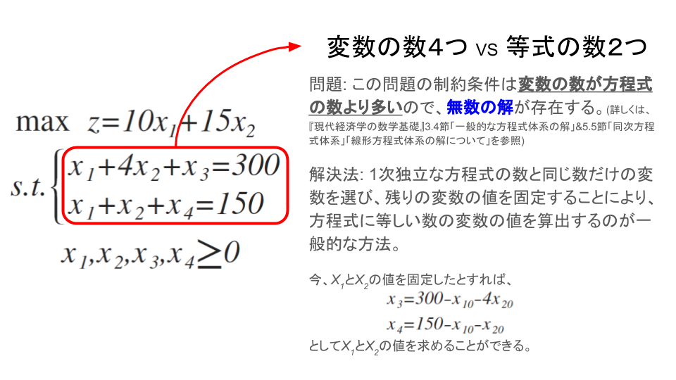

 - **基底変数**(basic variable): 固定された変数に関して解かれる変数(上記の問題でいう$x_{3},x_{4}$)
 - **非基底変数**(nonbasic variable): 固定された変数(上記の問題でいう$x_{1},x_{2}$)
 - **基底**(basis): 基底変数の集合
 - **非基底**(nonbasis): 非基底変数の集合

また、非基底変数の値は基本的には任意の正数($x_{1}, x_{2} \ge 0$)であればよいわけであるが、**線形計画法では、0にすることになっている**。

 - 非基底変数を0に固定したときの解を**基底解**(basic solution)
    - **基底解**のなかで非負条件を満足する解を**実行可能基底解**(basic feasible solution;略して可能基底解ともよぶ)
        - **実行可能基底解**のなかで目的関数を最大(最小化問題では最小)にする解が**最適解**

ここまでの議論で次の定理が示せる。【定理2.2】の頂点は、**実行可能基底解**のことであり、そのなかに最適解が存在するのである。

> ### 【定理3.1】線形計画の基本定理(fundamental theorem)
> 標準形の線形計画問題が与えられたとき、その問題に実行可能解が存在するなら、必ず実行可能基底解が存在する。さらに、その問題に最適解が存在するなら、実行可能基底解のなかにも最適解が存在する。
>
> -実行可能解で最適解であるものを**最適基底解**(optimal basic solution)という。

また、変数の数に対して方程式の数が少ないという問題の解決法からもわかるように次の定理が導ける。

> ### 【定理3.2】
> 与えられた標準形の線形計画問題の最適解においては、$n$個の変数のうちの$n - m$個の値は0である。
>
>上記の問題の方程式
>$$
>{ x }_{ 3 }=300-{ x }_{ 10 }-4{ x }_{ 20 }\\ { x }_{ 4 }=150-{ x }_{ 10 }-{ x }_{ 20 }
>$$
>に$x_{1}=x_{2}=0$としたときの解は、$x_{1}=0,x_{2}=0,x_{3}=300,x_{4}=150$となる。

以上のことから、線形計画問題の最適解をみつけるには実行可能領域の頂点だけを調べればよい。頂点(実行可能基底解)では$n$個の変数のうち$m$個が正であるから、その数は$n$個の変数から$m$個を取る組み合わせの数${ _{ n }{ C }_{ m } }$ということになる。

このとき、$n$と$m$の数が大きくなるとその組合わせの数は増大し、計算量が膨大になる。そこで、有効な組合せだけを用いて効率よく最適解を探し出す方法として考えられたのがシンプレックス法(simplex method; 単体法ともいう)である。

## シンプレックス法
### 原理と計算方法
> 次の線形計画をシンプレックス法を用いて解け。ただし、$x_{3},x_{4}$はスラック変数とする。
>$$
>z=29{ x }_{ 1 }+45{ x }_{ 2 }\\ \begin{cases} 2{ x }_{ 1 }+8{ x }_{ 2 }+{ x }_{ 3 }=60 \\ 4{ x }_{ 1 }+4{ x }_{ 2 }+{ x }_{ 4 }=60 \end{cases}\\ { x }_{ 1 },{ x }_{ 2 },{ x }_{ 3 },{ x }_{ 4 }\ge 0
>$$

なぜなら、(1)(2)で$x_{1},x_{2}$を少しだけ増やしても$x_{3}, x_{4}$は正のままで、(3)式より$z$の値が増加するからである。
そこで、(1)(2)で$x_{3},x_{4}$が**非負である限りできるだけ大きく**$x_{1}$または$x_{2}$を増やすことを考える。

**まず($x_{2} = 0$として、)$x_{1}$を増やすことを考える。**

 - (1)によれば、$x_{1}$が増えるにつれて$x_{3}$が減り、$x_{1}=30(=60/2)$で$x_{3} = 0$となる。
 - (2)によれば$x_{1} = 15 (= 60/4)$で$x_{4} = 0$となる。

したがって、$x_{1}$は**最大$x_{1} = 15$まで増やせる**。その結果、(3)の$z$は$\Delta z = 29 \times 15 = 435$だけ増加する。

**次に($x_{1} = 0$として、)$x_{2}$を増やすことを考える。**

 - (1)より$x_{2} = 7.5 (= 60/8)$まで増やすと$x_{3} = 0$となる
 - (2)より$x_{2} = 15 (= 60/4)$まで増やすと$x_{4} = 0$となる

したがって、$x_{2}$は**最大$x_{2} = 7.5$まで増やせる**。その結果、(3)の$z$は$\Delta z = 45 \times 7.5 = 337.5$だけ増加する。

→以上より、**$x_{1}$を増やしたほうが$z$の値がより増加する**。&$x_{1}$を限度いっぱいに増やすと**(2)の左辺の$x_{4}$が$0$となる。**そこで(2)の左辺の$x_{4}$を右辺に移し、右辺の$x_{1}$を左辺に移す。すると(2)は

$$
x_{1} = 15 - x_{2} - \frac {1}{4}x_{4}
$$

となる。これを(1)(3)に代入して$x_{1}$を消去すると、それぞれ次のようになる。
$$
x_{3} = 30 - 6x_{2} + \frac {1}{2} x_{4}\\
z = 435 + 16 x_{2} - 7.25 x_{4}
$$
以上をまとめると、次のようになる。

なぜなら(4)(5)で$x_{2}$を少しだけ増やしても$x_{3},x_{1}$は正のままで、(6)式より$z$の値が増加するからである。

そこで、$x_{2}$を($x_{4} = 0$として)増やす。

 - (4)式によれば$x_{2} = 5 (= 30/6)$まで増加すると$x_{3} = 0$となる
 - (5)式によれば$x_{2} = 15 (= 15/1)$まで増加すると$x_{1} = 0$となる

したがって、$x_{2}$は**最大$x_{2} = 5$まで増やせる**。そして$z$が$\Delta z = 16 \times 5 = 80$だけ増加し、その結果**(4)式の左辺の$x_{3}$が$0$になる**。

そこで(4)の左辺の$x_{3}$を右辺に移し、右辺の$x_{2}$を左辺に移す。すると(4)式は
$$
x_{2} = 5 - \frac {1}{6} x_{3} - \frac {1}{3} x_{4}
$$
となる。これを(5)、(6)に代入して$x_{2}$を消去すると、それぞれ次のようになる。
$$
x_{1} = 10 + \frac {1}{6} x_{3} - \frac {1}{3}x_{4}\\
z = 515 - 2.667 x_{3} - 5.917 x_{4}
$$
以上をまとめると、次のようになる。

したがって、$z$の最大値は
$$
z = 515
$$
である。

### 幾何学的解釈
幾何学的に解釈すると、シンプレックス法は可能領域のある頂点を出発点とし、**目的関数$z$の値が最も大きく増加するように辺に沿って移動し**、$z$が増加しなくなる頂点で終了するものである。

---
# シンプレックス・タブロー

### シンプレックス表によるプログラミング
シンプレックス法を次のように一般化する。
$$
\max { \quad z={ c }_{ 0 }+{ c }_{ 1 }{ x }_{ a }+\cdots +{ c }_{ j }{ x }_{ b }+\cdots +{ c }_{ n }{ x }_{ c } } \\ s.t.\begin{cases} { a }_{ 11 }{ x }_{ a }+\cdots +{ a }_{ 1j }{ x }_{ b }+\cdots +{ a }_{ 1n }{ x }_{ c }\le { b }_{ 1 } \\ \vdots  \\ { a }_{ i1 }{ x }_{ a }+\cdots +{ a }_{ ij }{ x }_{ b }+\cdots +{ a }_{ in }{ x }_{ c }\le { b }_{ i } \\ \vdots  \\ { a }_{ m1 }{ x }_{ a }+\cdots +{ a }_{ mj }{ x }_{ b }+\cdots +{ a }_{ mn }{ x }_{ c }\le { b }_{ m } \end{cases}\\ { x }_{ a },\cdots ,{ x }_{ b },\cdots ,{ x }_{ c }\ge 0
$$

上記の最大化問題の制約条件式を基底変数と非基底変数に分ける。スラック変数を基底変数にするのが通例である。以下ではスラック変数を$x_{\alpha}, \cdots, x_{\beta}, \cdots, x_{\gamma}$とする。

$$
x_{\alpha} = b_{1} - a_{11}x_{a} - \cdots - a_{1j}x_{b} - \cdots - a_{1n}x_{c}\\
\vdots\\
x_{\beta} = b_{i} - a_{21}x_{a} - \cdots - a_{2j}x_{b} - \cdots - a_{2n}x_{c}\\
\vdots\\
x_{\gamma} = b_{m} - a_{m1}x_{a} - \cdots - a_{mj}x_{b} - \cdots - a_{mn}x_{c}\\
z = c_{0} + c_{1}x_{a} + \cdots + c_{j}x_{b} + \cdots + c_{n}x_{c}
$$
ただし、$b_{1} \ge 0, \dots, b_{i} \ge 0, \dots, b_{m} \ge 0$であるとする。この式を次のような表に表す。これを**シンプレックス法**(または**タブロー**)という。

### 退化

### 人工変数(人為変数)
これまでは、最大化問題で、しかも制約不等式のなかの不等号の向きが$\le$の場合だけ扱ってきた。しかし、実際には最小化問題もあるし、不等号の向きが逆向きの$\ge$である制約不等式や最初から等号($=$)である等式制約が含まれることが多い。ここでは、このような場合の対処の仕方について紹介する。

## シンプレックス指標と収束性

### シンプレックス指標

### シンプレックス法の収束

### シャドープライス

