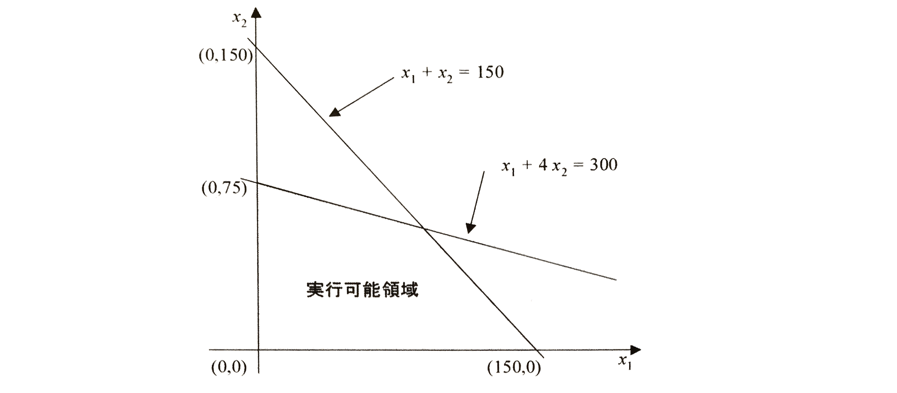

# 線形計画モデル
線形計画モデルの構築手順

 1. 当面する問題を明確に定義する: その**目的**、**代替行動**、**制約**などをはっきり示す必要がある
 2. 1.の定義に従って数学モデルを構成(定式化)する
    1. 決定すべき未知の変数(独立変数、説明変数)を明確にし、それらにわかりやすい名前や記号を割り当てる
    2. 最大化または最小化するための目的関数(objective function)を定式化する
    3. その問題のすべての制限や制約(constraints)を定式化する

線形計画モデルは、これらの式がすべて**1次式**で表されるもので、その取り扱いの容易さから広く利用されている。

> **最大化問題**(maximization problem)
> $$
>\max { \quad z={ c }_{ 1 }{ x }_{ 1 }+{ c }_{ 2 }{ x }_{ 2 }+\cdots +{ c }_{ n }{ x }_{ n } } \\ s.t.\begin{cases} { a }_{ 11 }{ x }_{ 1 }+{ a }_{ 12 }{ x }_{ 2 }+\cdots +{ a }_{ 1n }{ x }_{ n }\le { b }_{ 1 } \\ { a }_{ 21 }{ x }_{ 2 }+{ a }_{ 22 }{ x }_{ 2 }+\cdots +{ a }_{ 2n }{ x }_{ n }\le { b }_{ 2 } \\ \cdots  \\ { a }_{ m1 }{ x }_{ 1 }+{ a }_{ m2 }{ x }_{ 2 }+\cdots +{ a }_{ mn }{ x }_{ n }\le { b }_{ m } \end{cases}\\ { x }_{ 1 },{ x }_{ 2 },\cdots ,{ x }_{ n }\ge 0
> $$

 

> **最小化問題**(minimization problem)
> $$
> \min { \quad z={ c }_{ 1 }{ x }_{ 1 }+{ c }_{ 2 }{ x }_{ 2 }+\cdots +{ c }_{ n }{ x }_{ n } } \\ s.t.\begin{cases} { a }_{ 11 }{ x }_{ 1 }+{ a }_{ 12 }{ x }_{ 2 }+\cdots +{ a }_{ 1n }{ x }_{ n }\ge { b }_{ 1 } \\ { a }_{ 21 }{ x }_{ 2 }+{ a }_{ 22 }{ x }_{ 2 }+\cdots +{ a }_{ 2n }{ x }_{ n }\ge { b }_{ 2 } \\ \cdots  \\ { a }_{ m1 }{ x }_{ 1 }+{ a }_{ m2 }{ x }_{ 2 }+\cdots +{ a }_{ mn }{ x }_{ n }\ge { b }_{ m } \end{cases}\\ { x }_{ 1 },{ x }_{ 2 },\cdots ,{ x }_{ n }\ge 0
> $$

## 1. 実行可能領域

| 用語 | 説明 |
|:---:|:-----|
| **実行可能領域**(feasible region) | 線形計画モデルの制約条件のような不等式をすべて満たす点の集合 |
| **実行可能解** (feasible solution; 可能解、許容解) | 実行可能領域に含まれる点 |
| **最適解** | 実行可能解のなかで、目的関数の値を最大(最小化問題では最小)にするもの |
| **実行不能解**(infeasible solution; 不能解) | 制約条件をすべて満たすことができない解のこと |

ここで、次のような最大化問題を考える。この制約条件の実行可能領域は下の図のようになる。
> $$
> \max {\quad z = 10x_{1} + 15x_{2}}\\
> s.t. \quad x_{1} + 4x_{2} \le 300\\
> \quad x_{1} + x_{2} \le 150\\
> \quad x_{1},x_{2} \ge 0
> $$

| 制約条件の実行可能領域 | 線形計画モデルの図示 |
|:-----------------------------------------:|:-----------------------------------------:|
|||

上記の制約条件では２つの変数しかないので、実行可能領域は2次元となるが、$n$変数をもつ場合には$n$次元の**凸多面体(=凸集合)**(convex polyhedron)となる。

このことから、次の定理が得られる。

> ### 【定理2.1】
> 線形計画モデルの実行可能領域は、$n$次元空間内の凸多面体(凸集合)である

しかし、最適解が存在しない場合もある。

**非有界の問題** 
つぎのような線形計画モデルの制約条件の実行可能領域がどのようになるのかを考える。

$$
\min {\quad z = 400x_{1} + 700x_{2}}\\
s.t. \quad 30x_{1}+ 20x_{2} \ge 60\\
\quad 20x_{1} + 40x_{2} \ge 100\\
\quad 5x_{1} + 25x_{2} \ge 50\\
x_{1},x_{2} \ge 0
$$
この場合の実行可能領域を図示すると、下の図のようになる。

ここで注意しなければならないことは、制約条件を満たす実行可能領域が有界ではない、つまり閉じていないことである。このような実行可能領域のことを一般に非有界(unbounded)という。

上の図のような閉じていない実行可能領域を線形計画法の立場からみた場合、説明変数の値を無限に大きくできるため、問題によってはその目的関数値がいくらでも大きくなったり小さくなったりする可能性があり、最適解を特定できないということになる。したがって、線形計画法ではこのような問題を非有界の問題と呼び、最適解が存在しないとしている。

**実行不能な問題** 
つぎに最初から実行可能領域がない場合を考える。例えば、つぎのような制約条件を考える。
$$
s.t. \quad x_{1} + x_{2} \le 2\\
\quad x_{1} + x_{2} \ge 6\\
\quad x_{1},x_{2} \ge 0
$$
この領域を図示すると、以下の図のようになり共通領域が存在しない。

したがって、すべての制約式を満たすことができないため、実行可能解が存在せず、最適解もないことになる。線形計画法ではこのような問題のことを実行不能(infeasible)な問題という。

> このことから、線形計画問題が最適解をもたないのはつぎの場合である。
>
> 1. 実行可能領域が非有界で、目的関数が発散する
> 2. 実行可能領域が存在しない

 

また、以下のことも見当が付く。

> ### 【定理2.2】
> 与えられた線形計画問題に最適解が存在すれば、目的関数は実行可能領域の境界上または頂点(vertex)で最適値をとる

$n$次元多面体の頂点では、$n$個の境界面が交わっている。実行可能領域の各境界面は、線形計画モデルの$n + m$個の不等式を等号に置き変えたもの(つまり、等式に直したもの)のどれかと考えることができる。

## 図式解法
ここでは、線形計画法の幾何学的な理解を深めるために、グラフを用いて線形計画問題を解く図式解法(graphical solution)を示す。この解法は図を使うため3変数つまり、3次元に限定される。

つぎのような2変数を伴う生産計画問題を図式解法で解くことにする。
$$
\max {\quad z = 10x_{1} + 15x_{2}}\\
s.t. \quad x_{1} + 4x_{2} \le 300\\
\quad x_{1} + x_{2} \le 150\\
\quad x_{1},x_{2} \ge 0
$$

|  |  |
|:----------------------------------:|:----------------------------------:|
|  |  |
|  |  |

ただし、上述の方法はすべての端点を調べてその目的関数値を計算するため、制約式の数が増えて端点の数が多くなると時間がかかることになる。そこで、グラフ上でより効率的に最適解を見つける方法を示す。

### レベルカーブを用いた図式解法
この方法では、実行可能領域を特定するまでは上述の方法と同じである。その後、レベルカーブ(level curve)と呼ばれる等しい目的関数値をもつ等価線分を用いる。以下では、図式解法で用いた2変数を伴う生産計画問題を扱うものとする。

具体的には、

 1. 目的関数値が等しくなる等価線分をプロットする。
 2. レベルカーブは原点から離れると目的関数の値が大きくなり、逆に近付くと小さくなる性質(ただし、最小化問題で目的関数が負の係数を持っている場合は当てはまらない)のがあるので、この最大化問題では、下の図に示すように実行可能領域の境界に達するまで原点から遠ざけるように平行移動する。そのとき、レベルカーブが最後に接する点(あるいは線や面)が最適解である。

> (例: 献立問題)
>
> 最小化問題の例として、次の献立問題を取り上げる。
> $$
> \min {\quad z = 400x_{1} + 700x_{2}}\\
> s.t. \quad 30x_{1} + 20x_{2} \ge 60\\
> \quad 20x_{1} + 40x_{2} \ge 100\\
> \quad 5x_{1} + 25x_{2} \ge 50\\
> \quad x_{1},x_{2} \ge 0
> $$
> この献立問題の実行可能領域は非有界であり、説明変数$x_{1},x_{2}$のどちらお無限大まで増加できるということである。ただし、この問題は最小化問題であり、しかも目的関数の係数はどちらも非負であるので、説明変数が無限大の値をとる場合を考える必要はない。したがって、最適解の候補としては、端点A,B,C,Dとなる。

| 実行可能領域(レベルカーブ付き) | 線形計画モデル | 解の候補 |
|:----------:|:------------:|:------------:|
|  |  |  |

 

> ### 線形計画問題を解く図式解法の計算手順
>
> 1. **[座標系の定義]**: グラフ上に座標軸を描き、各軸に説明変数を割り当てる
> 2. **[制約条件のプロット]**: 各制約条件式に対し、等式の場合には直線、不等式の場合には領域を描く。
> 3. **[実行可能領域の特定]**: 2.で描かれたすべての領域の共通領域がこの問題のすべての制約条件を満足する点の集合、すなわち実行可能領域となる。この実行可能領域が空、すなわち存在しない場合は、制約条件をすべて満たす解が存在しないので、実行不能な問題として終了する。
> 4. **[目的関数のプロット]**: 目的関数の傾きを調べ、実行可能領域内の任意の場所に目的関数の等価線分(レベルカーブ)を書き込む
> 5. **[最適解の特定]**:
>       - 最大化問題: 実行可能領域の境界に達するまで原点から遠ざけるようレベルカーブを平行移動することにより、最適解をみつける
>       - 最小化問題: 原点に近づけるように平行移動することによって最適解をみつける

## 特殊な例
**非有界な問題の例(最適解が存在しないケース)** 
上述した献立問題を考える。この問題の実行可能領域は非有界であり、説明変数はともに無限大の値をもつことができる。もしこの問題が最小化問題ではなく最大化問題だった場合は、つまり

> $$
> \max {\quad z = 400x_{1} + 700x_{2}}\\
> s.t. \quad 30x_{1} + 20x_{2} \ge 60\\
> \quad 20x_{1} + 40x_{2} \ge 100\\
> \quad 5x_{1} + 25x_{2} \ge 50\\
> \quad x_{1},x_{2} \ge 0
> $$

の場合は、目的関数の値は限りなく大きくできることになる。したがって、最大値を特定できないため、この問題に最適解は存在しない。

**実行不能な問題の例(最適解が存在しないケース)** 
次のような問題を考える。
$$
\min {\quad z = 2x_{1} + x_{2}}\\
s.t. \quad x_{1} + x_{2} \le 2\\
\quad x_{1} + 2x_{2} \ge 6\\
\quad x_{1},x_{2} \ge 0
$$
この実行可能領域を図示すると以下の図になり、共通領域が存在しない。

したがって、すべての制約式を満たすことができないため、実行可能解が存在せず、最適解もないことになる。このような問題を実行不能な問題という。

**複数の最適解をもつ問題の例** 
複数の最適解が存在する場合を説明するために、次のような生産計画問題を考える。

$$
\max {\quad z = 5x_{1} + 20x_{2}}\\
s.t. \quad x_{1} + 4x_{2} \le 300\\
\quad x_{1} + x_{2} \le 150\\
\quad x_{1},x_{2} \ge 0
$$

この制約条件式の実行可能領域にレベルカーブをプロットすると下の図になる。

上の図のように、端点A,Bはともに最適解ということになり、常に一つとはかぎらず、複数存在する場合もある。

複数の最適解をもつケースは、図からも明らかなように、目的関数のレベルカーブの傾きと実行可能領域を形成している制約式に対応する線分の傾きが一致する場合に発生する。

**退化の例** 
> 集合内の任意の2点を結ぶ線分がすべてその集合内に含まれるような集合を凸集合(convex set)というが、凸集合の端点は$n$次元空間における凸多面体の頂点の概念を一般化したものである。
> 
> この凸多面体の頂点は$n$個の境界面の交わりとして定義される。**退化(degeneracy)**とは、**$n + 1$個以上の平面が交わっている状態**をいう。

退化が起こる場面を説明するために、次のような線形計画問題(一番はじめの例題に1つ制約式を加えたもの)を考える。
$$
\max {\quad z = 10x_{1} + 15x_{2}}\\
s.t. \\
\begin{eqnarray}
x_{1} + 4x_{2} & \le & 300\\
x_{1} + x_{2} & \le & 150\\
2x_{1} + x_{2} & \le & 300\\
x_{1},x_{2} & \ge & 0
\end{eqnarray}
$$
この問題の実行可能領域は、下の図のようになる。

図をみると明らかであるが、この問題の実行可能領域は端点A,B,C,Dの領域である。この実行可能領域に対して、直線$2x_{1} + x_{2} \le 300$は頂点$C$でのみ関与する。つまり、この頂点$C$については2直線の交点という意味で次のような3通りの解釈が可能となる。

> 1. 直線$x_{1} = 0$と直線$x_{1} + x_{2} = 150$との交点
> 2. 直線$x_{1} + x_{2} = 150$と直線$2x_{1} + x_{2} = 300$との交点
> 2. 直線$x_{1} = 0$と直線$2x_{1} + x_{2} = 300$との交点

これらのなかで、実行可能領域を表す境界線の交点は1番目のもので、他の二つでは最適解に到達できない。ただし、目的関数値は三つとも同じである。したがって、残り二つのように解釈した場合は1番目のものに乗り換える必要がある。つまり、**本来1番目のものと解釈すべき交点Cの解釈を残り二つのように解釈したために発生する現象が退化である**。

退化は発生してもかまわず乗り換え(処理)を進めることによって抜け出すことが可能であるが、**運悪く何回乗り換えてももとの状態に戻ってしまう現象**が発生することもある。このような現象のことを**巡回(cycling)**という。上記の例は2次元であるため、すぐに退化が発生していることがわかるが3次元よりも高次元になるとわからない。

このような現象は、後述のシンプレックス法においても発生し、そのための対策も考察されている。
