# 2. シンプレックス法
線形計画問題の汎用解法としてもっともよく知られているシンプレックス法を取り上げ、その基礎となる基本定理や解の収束性などについて示す。

## 2.1. 標準形の線形計画問題
線形計画問題を汎用性の高い手法を用いて解く場合、不等式制約でなく等式制約として扱うほうが便利なことが多い。したがって、不等式制約をもつ線形計画問題を何らかの変換を用いて次のような1次の等式制約と非負条件をもつ問題に変換して扱われることになる。

	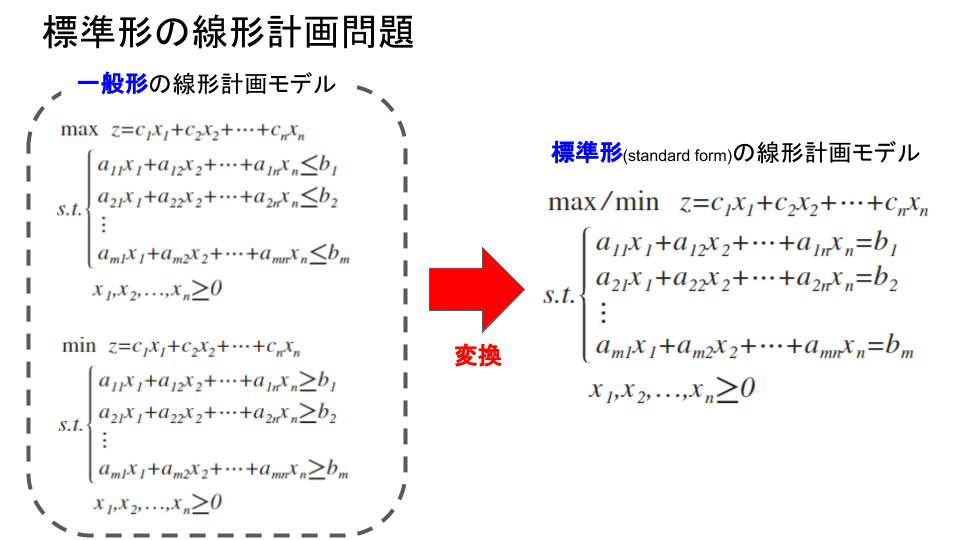

| 用語 | 説明 |
|:----:|:----|
| **標準形**(standard form)の線形計画モデル | **等式制約**をもつ線形計画問題のこと |
| **一般形**の線形計画モデル | **不等式制約**をもつ線形計画問題のこと |

一般形から標準形への変換は、補助変数を用いて容易に行うことができる。例えば、以下の最大化問題
$$
\max { \quad z=c_{ 1 }x_{ 1 }+c_{ 2 }x_{ 2 }+\cdots +c_{ n }x_{ n } } \\ s.t.\begin{cases} { a }_{ 11 }{ x }_{ 1 }+{ a }_{ 12 }{ x }_{ 2 }+\cdots +{ a }_{ 1n }{ x }_{ n }\le { b }_{ 1 } \\ { a }_{ 21 }{ x }_{ 1 }+{ a }_{ 22 }{ x }_{ 2 }+\cdots +{ a }_{ 2n }{ x }_{ n }\le { b }_{ 2 } \\ \vdots  \\ { a }_{ m1 }{ x }_{ 1 }+{ a }_{ m2 }{ x }_{ 2 }+\cdots +{ a }_{ mn }{ x }_{ n }\le { b }_{ m } \end{cases}\\ \qquad { x }_{ 1 },{ x }_{ 2 },\dots ,{ x }_{ n }\ge 0
$$
の場合は、$m$個の制約条件を形成する連立1次不等式に新しく$m$個の非負の補助変数を導入することで、つぎのような等式制約条件をもつ標準形の線形計画モデルに容易に変換できる。
$$
\max { \quad z=c_{ 1 }x_{ 1 }+c_{ 2 }x_{ 2 }+\cdots +c_{ n }x_{ n } } \\ s.t.\begin{cases} { a }_{ 11 }{ x }_{ 1 }+{ a }_{ 12 }{ x }_{ 2 }+\cdots +{ a }_{ 1n }{ x }_{ n }+{ \lambda  }_{ 1 }={ b }_{ 1 } \\ { a }_{ 21 }{ x }_{ 1 }+{ a }_{ 22 }{ x }_{ 2 }+\cdots +{ a }_{ 2n }{ x }_{ n }+{ \lambda  }_{ 2 }={ b }_{ 2 } \\ \vdots  \\ { a }_{ m1 }{ x }_{ 1 }+{ a }_{ m2 }{ x }_{ 2 }+\cdots +{ a }_{ mn }{ x }_{ n }+{ \lambda  }_{ m }={ b }_{ m } \end{cases}\\ \qquad { x }_{ 1 },{ x }_{ 2 },\dots ,{ x }_{ n },{ \lambda  }_{ 1 },{ \lambda  }_{ 2 },\dots ,{ \lambda  }_{ m }\ge 0
$$
ここで連立1次方程式に変換するために導入された非負の変数$\lambda_{1},\cdots,\lambda_{m}$は、不等式の左辺と右辺の差(左辺の右辺に対する不足)を表す補助変数で、**スラック変数**(slack variable)とよばれる。

また、$n$個の変数と$m$個の制約条件をもつ最小化問題
$$
\min { \quad z=c_{ 1 }x_{ 1 }+c_{ 2 }x_{ 2 }+\cdots +c_{ n }x_{ n } } \\ s.t.\begin{cases} { a }_{ 11 }{ x }_{ 1 }+{ a }_{ 12 }{ x }_{ 2 }+\cdots +{ a }_{ 1n }{ x }_{ n }\ge { b }_{ 1 } \\ { a }_{ 21 }{ x }_{ 1 }+{ a }_{ 22 }{ x }_{ 2 }+\cdots +{ a }_{ 2n }{ x }_{ n }\ge { b }_{ 2 } \\ \vdots  \\ { a }_{ m1 }{ x }_{ 1 }+{ a }_{ m2 }{ x }_{ 2 }+\cdots +{ a }_{ mn }{ x }_{ n }\ge { b }_{ m } \end{cases}\\ \qquad { x }_{ 1 },{ x }_{ 2 },\dots ,{ x }_{ n }\ge 0
$$
でも、$m$個の制約条件を形成する連立1次不等式に新しく$m$個の非負の補助変数を導入すると、つぎのような等式制約条件をもつ標準形の線形計画モデルに容易に変換できる。
$$
\min { \quad z=c_{ 1 }x_{ 1 }+c_{ 2 }x_{ 2 }+\cdots +c_{ n }x_{ n } } \\ s.t.\begin{cases} { a }_{ 11 }{ x }_{ 1 }+{ a }_{ 12 }{ x }_{ 2 }+\cdots +{ a }_{ 1n }{ x }_{ n }-{ \lambda  }_{ 1 }={ b }_{ 1 } \\ { a }_{ 21 }{ x }_{ 1 }+{ a }_{ 22 }{ x }_{ 2 }+\cdots +{ a }_{ 2n }{ x }_{ n }-{ \lambda  }_{ 2 }={ b }_{ 2 } \\ \vdots  \\ { a }_{ m1 }{ x }_{ 1 }+{ a }_{ m2 }{ x }_{ 2 }+\cdots +{ a }_{ mn }{ x }_{ n }-{ \lambda  }_{ m }={ b }_{ m } \end{cases}\\ \qquad { x }_{ 1 },{ x }_{ 2 },\dots ,{ x }_{ n },{ \lambda  }_{ 1 },{ \lambda  }_{ 2 },\dots ,{ \lambda  }_{ m }\ge 0
$$
ここで連立1次方程式に変換するために導入された非負の変数は、不等式の左辺と右辺の差(この場合は左辺の右辺に対する超過)を表す補助変数で、**サープラス変数**(surplus variable)とよばれる。

このように、線形計画問題の一般形から標準形への変換は大変容易に行うことができる。

## 2.2. 基底形式と基本定理
ここで次のような生産計画の問題を考える。説明の都合上、スラック変数$\lambda_{1}, \lambda_{2}$を$x_{3}, x_{4}$として以下のようにする。
$$
\max { \quad z=10x_{ 1 }+15x_{ 2 } } \\ s.t.\begin{cases} { x }_{ 1 }+4{ x }_{ 2 }+{ x }_{ 3 }=300 \\ { x }_{ 1 }+{ x }_{ 2 }+{ x }_{ 4 }=150 \end{cases}\\ \qquad { x }_{ 1 },{ x }_{ 2 },{ x }_{ 3 },{ x }_{ 4 }\ge 0
$$
このモデルでは、変数の数が４つであるのに対して等式の数が２つしかないことに注意してほしい。

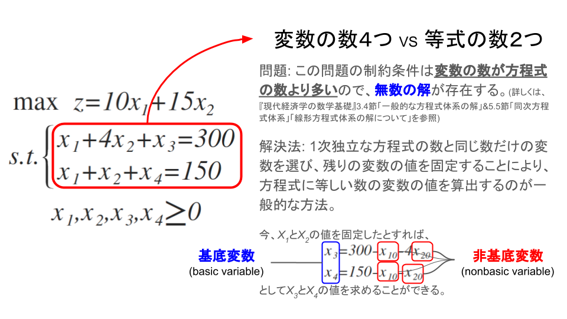

| 用語 | 説明 |
|:----:|-----|
| **基底変数**(basic variable) | 固定された変数に関して解かれる変数(上記の問題でいう$x_{3},x_{4}$) |
| **非基底変数**(nonbasic variable) | 固定された変数(上記の問題でいう$x_{1},x_{2}$) |
| **基底**(basis) | 基底変数の集合 |
| **非基底**(nonbasis) | 非基底変数の集合 |

また、非基底変数の値は基本的には任意の正数($x_{1}, x_{2} \ge 0$)であればよいわけであるが、**線形計画法では、0にすることになっている**。

 - 非基底変数を0に固定したときの解を**基底解**(basic solution)
    - **基底解**のなかで非負条件を満足する解を**実行可能基底解**(basic feasible solution;略して可能基底解ともよぶ)
        - **実行可能基底解**のなかで目的関数を最大(最小化問題では最小)にする解が**最適解**

ここまでの議論で次の定理が示せる。【定理2.2】の頂点は、**実行可能基底解**のことであり、そのなかに最適解が存在するのである。

> ### 【定理3.1】線形計画の基本定理(fundamental theorem)
> 標準形の線形計画問題が与えられたとき、その問題に実行可能解が存在するなら、必ず実行可能基底解が存在する。さらに、その問題に最適解が存在するなら、実行可能基底解のなかにも最適解が存在する。
>
> - 実行可能解で最適解であるものを**最適基底解**(optimal basic solution)という。

また、変数の数に対して方程式の数が少ないという問題の解決法からもわかるように次の定理が導ける。

> ### 【定理3.2】
> 与えられた標準形の線形計画問題の最適解においては、$n$個の変数のうちの$n - m$個の値は0である。
>
>上記の問題の方程式
>$$
>{ x }_{ 3 }=300-{ x }_{ 10 }-4{ x }_{ 20 }\\ { x }_{ 4 }=150-{ x }_{ 10 }-{ x }_{ 20 }
>$$
>に$x_{1}=x_{2}=0$としたときの解は、$x_{1}=0,x_{2}=0,x_{3}=300,x_{4}=150$となる。

以上のことから、線形計画問題の最適解をみつけるには実行可能領域の頂点だけを調べればよい。頂点(実行可能基底解)では$n$個の変数のうち$m$個が正であるから、その数は$n$個の変数から$m$個を取る組み合わせの数${ _{ n }{ C }_{ m } }$ということになる。

このとき、$n$と$m$の数が大きくなるとその組合わせの数は増大し、計算量が膨大になる。そこで、有効な組合せだけを用いて効率よく最適解を探し出す方法として考えられたのがシンプレックス法(simplex method; 単体法ともいう)である。

## 2.3. シンプレックス法
### 2.3.1. 原理と計算方法
> 次の線形計画をシンプレックス法を用いて解け。ただし、$x_{3},x_{4}$はスラック変数とする。
>$$
>\max {z=29{ x }_{ 1 }+45{ x }_{ 2 }}\\ \begin{cases} 2{ x }_{ 1 }+8{ x }_{ 2 }+{ x }_{ 3 }=60 \\ 4{ x }_{ 1 }+4{ x }_{ 2 }+{ x }_{ 4 }=60 \end{cases}\\ { x }_{ 1 },{ x }_{ 2 },{ x }_{ 3 },{ x }_{ 4 }\ge 0
>$$

なぜなら、(1)(2)で$x_{1},x_{2}$を少しだけ増やしても$x_{3}, x_{4}$は正のままで、(3)式より$z$の値が増加するからである。
そこで、(1)(2)で$x_{3},x_{4}$が**非負である限りできるだけ大きく**$x_{1}$または$x_{2}$を増やすことを考える。

**まず($x_{2} = 0$として、)$x_{1}$を増やすことを考える。**

 - (1)によれば、$x_{1}$が増えるにつれて$x_{3}$が減り、$x_{1}=30(=60/2)$で$x_{3} = 0$となる。
 - (2)によれば$x_{1} = 15 (= 60/4)$で$x_{4} = 0$となる。

したがって、$x_{1}$は**最大$x_{1} = 15$まで増やせる**。その結果、(3)の$z$は$\Delta z = 29 \times 15 = 435$だけ増加する。

**次に($x_{1} = 0$として、)$x_{2}$を増やすことを考える。**

 - (1)より$x_{2} = 7.5 (= 60/8)$まで増やすと$x_{3} = 0$となる
 - (2)より$x_{2} = 15 (= 60/4)$まで増やすと$x_{4} = 0$となる

したがって、$x_{2}$は**最大$x_{2} = 7.5$まで増やせる**。その結果、(3)の$z$は$\Delta z = 45 \times 7.5 = 337.5$だけ増加する。

→以上より、**$x_{1}$を増やしたほうが$z$の値がより増加する**。&$x_{1}$を限度いっぱいに増やすと**(2)の左辺の$x_{4}$が$0$となる。**そこで(2)の左辺の$x_{4}$を右辺に移し、右辺の$x_{1}$を左辺に移す。すると(2)は

$$
x_{1} = 15 - x_{2} - \frac {1}{4}x_{4}
$$

となる。これを(1)(3)に代入して$x_{1}$を消去すると、それぞれ次のようになる。
$$
x_{3} = 30 - 6x_{2} + \frac {1}{2} x_{4}\\
z = 435 + 16 x_{2} - 7.25 x_{4}
$$
以上をまとめると、次のようになる。

なぜなら(4)(5)で$x_{2}$を少しだけ増やしても$x_{3},x_{1}$は正のままで、(6)式より$z$の値が増加するからである。

そこで、$x_{2}$を($x_{4} = 0$として)増やす。

 - (4)式によれば$x_{2} = 5 (= 30/6)$まで増加すると$x_{3} = 0$となる
 - (5)式によれば$x_{2} = 15 (= 15/1)$まで増加すると$x_{1} = 0$となる

したがって、$x_{2}$は**最大$x_{2} = 5$まで増やせる**。そして$z$が$\Delta z = 16 \times 5 = 80$だけ増加し、その結果**(4)式の左辺の$x_{3}$が$0$になる**。

そこで(4)の左辺の$x_{3}$を右辺に移し、右辺の$x_{2}$を左辺に移す。すると(4)式は
$$
x_{2} = 5 - \frac {1}{6} x_{3} - \frac {1}{3} x_{4}
$$
となる。これを(5)、(6)に代入して$x_{2}$を消去すると、それぞれ次のようになる。
$$
x_{1} = 10 + \frac {1}{6} x_{3} - \frac {1}{3}x_{4}\\
z = 515 - 2.667 x_{3} - 5.917 x_{4}
$$
以上をまとめると、次のようになる。

したがって、$z$の最大値は
$$
z = 515
$$
である。

### 2.3.2. 幾何学的解釈
幾何学的に解釈すると、シンプレックス法は可能領域のある頂点を出発点とし、**目的関数$z$の値が最も大きく増加するように辺に沿って移動し**、$z$が増加しなくなる頂点で終了するものである。

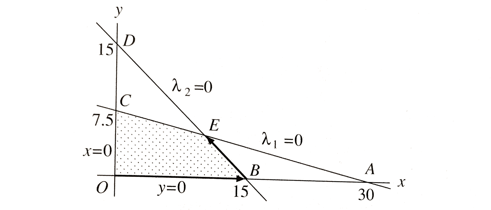

---
# シンプレックス・タブロー
前記のシンプレックス法の考え方で、シンプレックス法とは**新たに正となる右辺の変数(非基底変数)と0となった左辺の変数(基底変数)を入れ替えながら解を更新していく方法**であることが理解できたであろう。ここでは、変数を入れ替えるたびに生成される問題をよりコンパクトに表現するために考案されたシンプレックス・タブロー(simplex tableau; 単体表)について説明する。

## 例題
以下の一般形の線形計画問題を考えるとする。
> $$
\max {z = 10x_{1} + 15x_{2}}\\
s.t.\\
\begin{eqnarray}
x_{1} + 4x_{2} & \le & 300\\
x_{1} + x_{2}  & \le & 150
\end{eqnarray}\\
x_{1},x_{2} \ge 0
$$

### ステップ0) 初期化
> 線形計画問題が**標準形**でかつ、**rhs定数**(数式の右辺 right-hand side)がすべて非負になるようにして、各データをタブロー形式に設定する。

上記の一般形の線形計画問題において、目的関数の変数をすべて左辺に移項して制約条件を加えると、次のようになる。

$$
\max {z}\\
subject.to. \quad
\begin{matrix}
z & - 10 x_{1} & + 15 x_{2} &         &        & = & 0\\
  &      x_{1} & +  4 x_{2} & + x_{3} &        & = & 300\\
  &      x_{1} & +    x_{2} &         & +x_{4} & = & 150\\
\end{matrix}\\
x_{1}, x_{2}, x_{3}, x_{4} \le 0
$$

ただし、$x_{3},x_{4}$はスラック変数である。このように**標準形**の線形計画問題で、かつ、右辺の定数(rhs定数)がすべて**非負**に変形できました。
この線形計画問題をシンプレックス・タブローで表すと次のようになる。

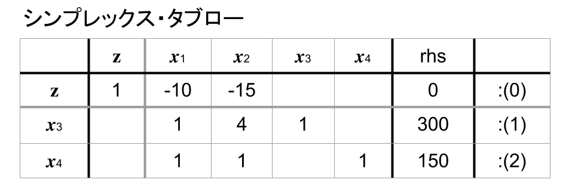

### ステップ1) 最適性テスト
> あるシンプレックス・タブローにおいて、非基底変数に対応する変数の目的関数行(0)の値(係数)が負で、それ以外に少なくとも一つ以上の正の値(係数)をもつものがあるときは、そのなかから最小の目的関数行(0)の値(係数)をもつ変数を基底い入れる変数として選ぶ。最小値(最小係数)が複数あるときは任意に選んでよい。

#### ステップ1.1) 最適解なのかのチェック
> 非基底変数に対応する変数の目的関数行(0)の値(係数)が負の場合、最適解ではない
> 
> **非有界な問題** 
> シンプレックス・タブローにおいて、非基底変数に対応する列ベクトルの目的関数行:(0)の値が負で、それ以外の要素の値もすべて負のときは、その問題は非有界で目的関数の値をいくらでも大きくできる。したがって、非有界な問題として最適解の探索を打ち切る。
>
> **実行不能な問題** 
> 最終のシンプレックス・タブローにおいて**基底解に$0$でない人為変数が含まれるかどうかをみればよい**。もし含まれる場合には、その問題は実行不能である。
>
> **複数の最適解をもつ問題** 
> 最終のシンプレックス・タブローにおいて、**基底に人為変数がなく**、**非基底変数ベクトルの目的関数行の要素に$0$をもつものがある**場合には、その問題には複数個の最適解が存在することを意味する。

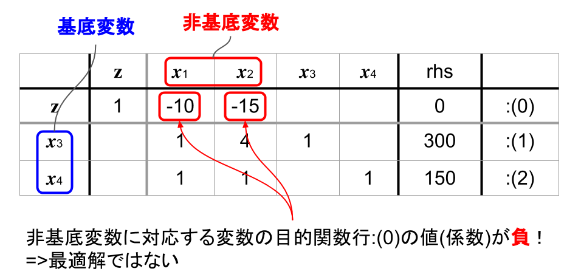

非基底変数をすべて0とおくと、それぞれ次の値をもち、
$$
x_{1} = 0, x_{2} = 0, x_{3} = 300, x_{4} = 150
$$
そのときの目的関数$z$の値が0になる。

上記のシンプレックス・タブローから**非基底変数($x_{1}, x_{2}$)に対応する目的関数行の係数が、負である**ため、最適解ではない。なぜなら、式:(1),:(2)で現在$0$になっている$x_{1},x_{2}$の値を少しだけ増やしても$x_{3},x_{4}$は正のままであるが、目的関数(0)の値は0から増加するからである。

※目的変数の係数の符号が逆になっていることに注意。

#### ステップ1.2) 基底に入る変数を決める
> 最小の目的関数行(0)の値(係数)をもつ変数を基底い入れる変数として選ぶ

※目的変数の係数の符号が逆になっていることに注意してほしい。したがって、**0から増加させる変数(非基底変数)を選ぶとき、目的関数行(0)において負で最小な値(移項すると正で最大な値となる)をもつ変数を選ぶことになる。**

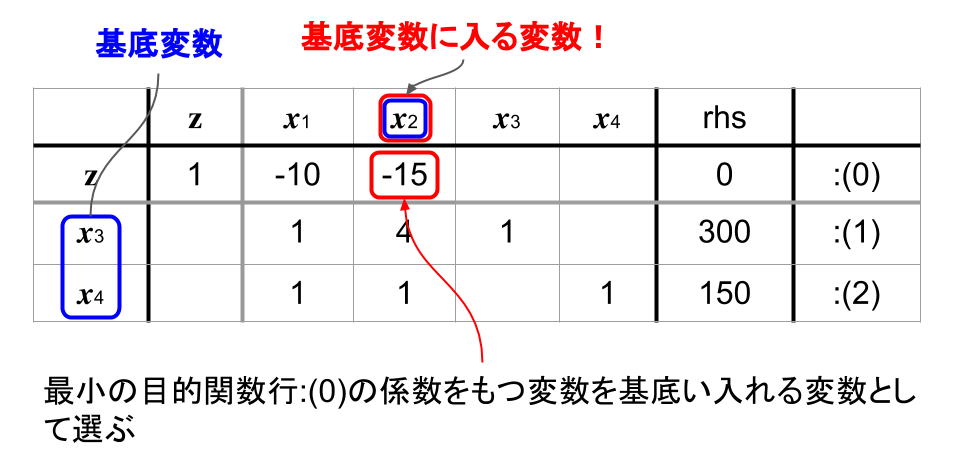

よって、最小係数$-15$をもつ変数$x_{2}$の値を増やすことを考える。

### ステップ2) 最小比テスト
> 基底に入る候補として選ばれた変数の制約条件に対応する行の正の値をもつ要素で、対応する右辺(rhs)の値を割った値が最小になる行に含まれる基底変数の列ベクトルを基底から出るベクトルとして選ぶ。

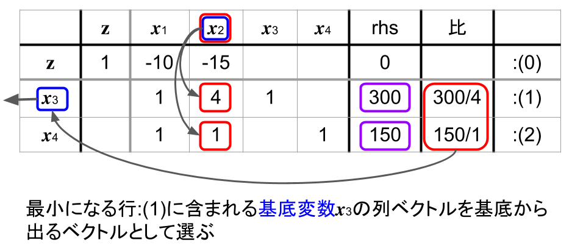

この場合、$\frac {300}{4} = 75$となる行:(1)が最小になる。すなわち、$x_{3}$が基底から出ることになる。

### ステップ3) 基底変換
> 基底に入る非基底変数と基底から出る基底変数を入れ替える作業

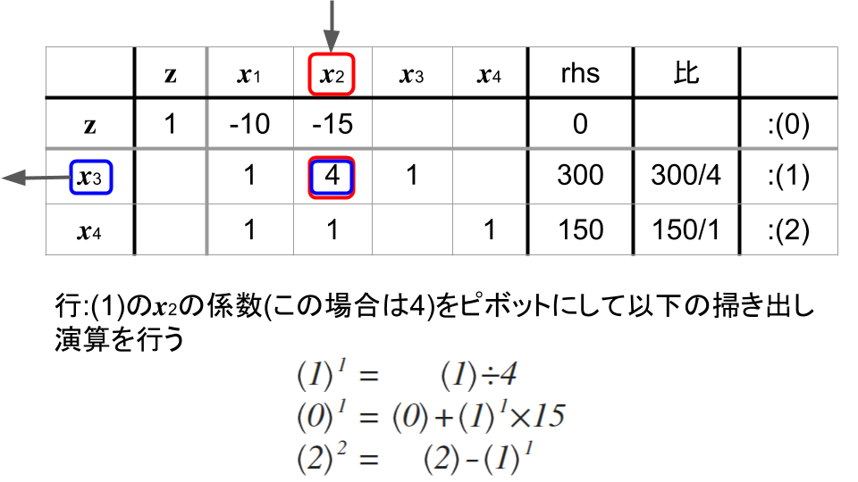

これにより、次のシンプレックス・タブローを得る。
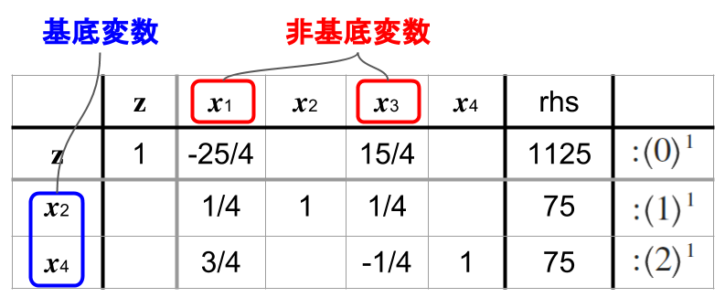

	<h2>ステップ1) 最適性テストへ戻る</h2>

<table>
	<tr>
		<td>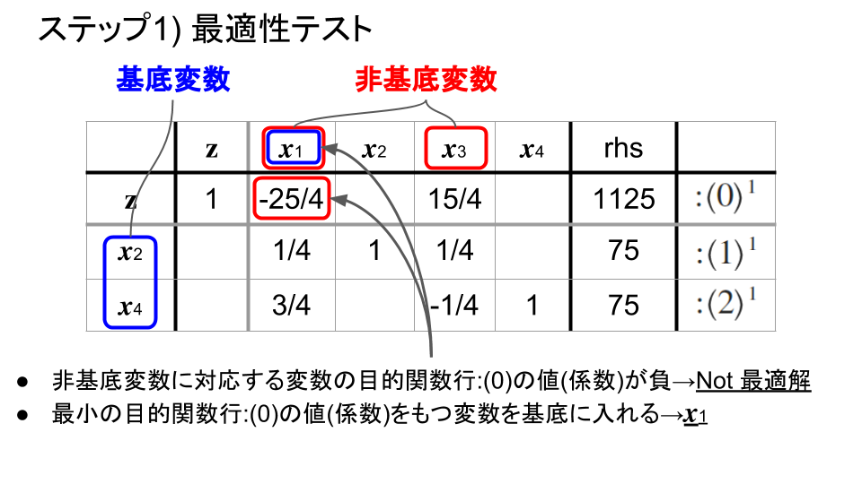</td>
		<td>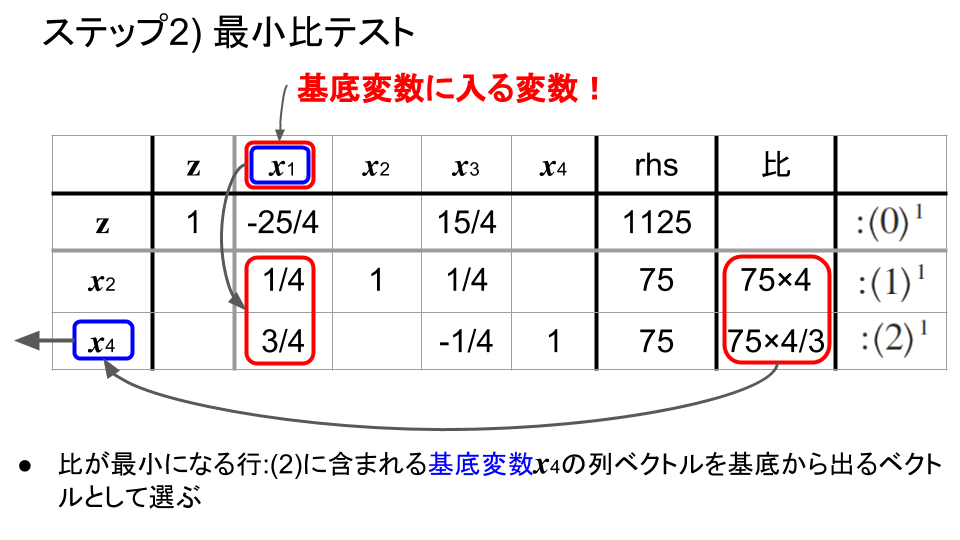</td>
	</tr>
	<tr>
		<td>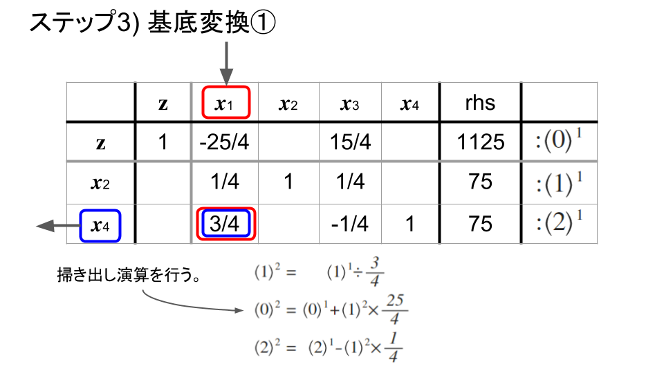</td>
		<td>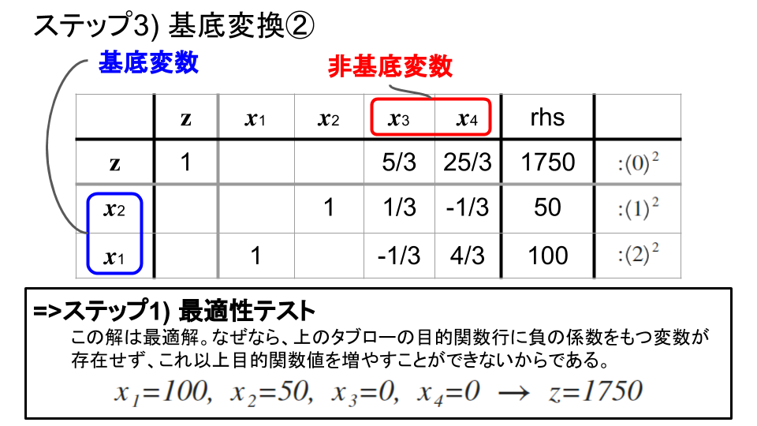</td>
	</tr>
</table>

## シンプレックス・タブロー法の一般化
以下の参考文献を参照するように。

金谷健一[2005]「6.5.3 シンプレックス表によるプログラミング」『これならわかる最適化数学 - 基礎原理から計算手法まで - 』共立出版株式会社

## 退化
**退化が起こらない場合** 
シンプレックス法は、退化が起こらないかぎり、必ず有限回の繰り返し計算(反復)で終了する。このことは次の理由による。

> - $n$個の変数から$m$個の基底変数を取り出す組合せの数は有限で$_{n}{C}_{m}$である
> - 基底変数の組が決まると、シンプレックス・タブローは定まり、そのときの実行可能基底解も一つに定まる

したがって、非退化の仮定の下では、シンプレックス法は必ず有限回の反復で終了することになる。

**退化が起こった場合** 
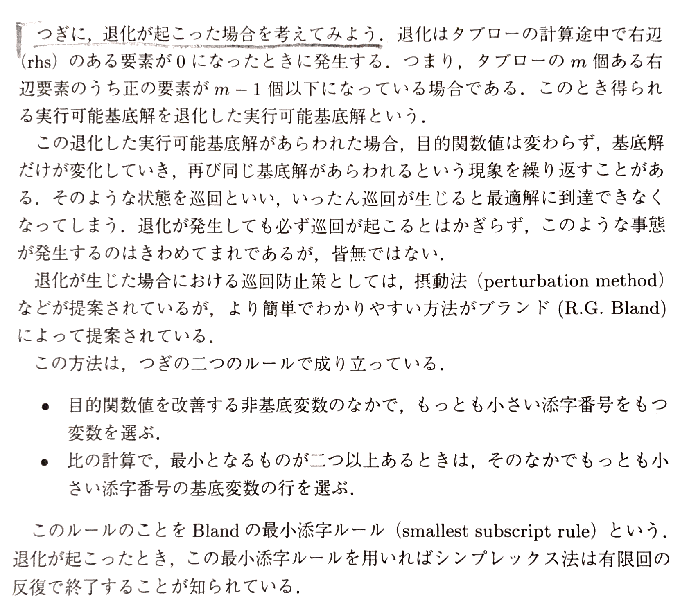

退化に関する参考文献は以下を参照するように。

 - 金谷健一[2005]「6.6 退化」『これならわかる最適化数学 - 基礎原理から計算手法まで - 』共立出版株式会社

## 例外への対処) 最小化問題の標準化
> ここまでは、最大化問題のみを扱ってきたが、実際には最小化問題もある。

最小化問題の場合は、その目的関数の両辺に$-1$をかけて$z^{\prime} = - z$と置くことにより最大化問題に変換して解くことができる。最小化問題のままで解く場合は、$z$行の係数のなかから**もっとも大きい正の係数をもつ変数(列)**を基底に入れる(値を減らす)変数として選ぶだけで、ほかは変わらない。

$$
\min {z} \rightarrow \max {-z}
$$

## 例外への対処) 人工変数(人為変数)
<table>
	<tr>
		<td></td>
		<td></td>
	</tr>
	<tr>
		<td></td>
	</tr>
</table>
