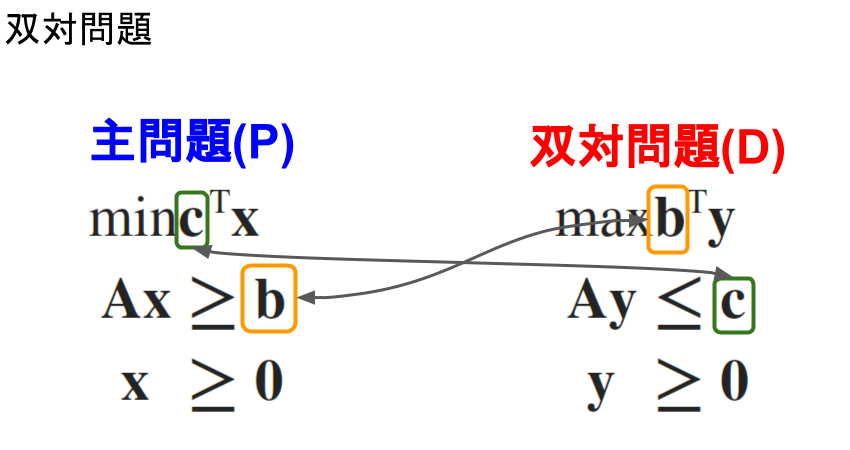

# 双対問題
## 双対問題
線形計画問題には、双対問題と呼ばれる裏に隠されたもう一つの問題がある。

### 例題) 栄養問題
#### 栄養問題
各栄養素には1日の最低摂取量が決められている。食品1,2には主に2種類の栄養素が含まれており、それぞれ以下のように各栄養素の最低摂取量と食品の価格が決まっている。

|  | 食品1($x_{1}$) | 食品2($x_{2}$) | 最低摂取量 |
|:--:|:---:|:--:|:--:|
| 価格 | $3$ | $1$ |  |
| 栄養A | $4$ | $3$ | $7$ |
| 栄養B | $5$ | $2$ | $8$ |

これらをもとに消費者と製薬会社が以下のような問題を考えた。

#### 消費者の視点
> **食費の最小化** 
> 必要な栄養を摂りながら食費を最小にするには、どのような割合で二つの食費を購入すればよいか。

食品$1,2$の量を$x_{1},x_{2}$とすると、問題は以下のように定式化できる。

$$
(\mathrm {P}_{0})\\
\begin{matrix}
\min {z} & = & 3 x_{1} & + & x_{2} \quad (食費)\\
subject.to.
&  & 4 x_{1} & + & 3 x_{2} & \ge & 7 \quad (栄養Aの摂取量)\\
&  & 5 x_{1} & + & 2 x_{2} & \ge & 8 \quad (栄養Bの摂取量)\\
\end{matrix}\\
x_{1},x_{2} \ge 0
$$

#### ビタミン剤を作る製薬会社の視点
一方、このような食品に対してある製薬会社が各要素を含むビタミン剤の価格を決めようとしている。このとき、食品との競合に勝てるようなビタミン剤の価格を決めたい。

> **ビタミン剤の売り上げ最大化** 
> 通常の食品より安く栄養を摂れるようにビタミン剤の価格を抑えながら、売上げを最大にするには、ビタミン剤の価格をどのように設定すれば良いだろうか。

栄養表により、食品1,2に含まれる栄養の量と食品1,2の価格との関係式を立てると以下のようになる。
$$
\begin{eqnarray}
4 \times y_{A} + 5 \times y_{B} & = & 3\\
3 \times y_{A} + 2 \times y_{B} & = & 1
\end{eqnarray}
$$

 - $y_{A}, y_{B}$ : 栄養A,Bの単位あたり価格

ここでビタミン剤Aとビタミン剤Bをそれぞれ栄養表Aと栄養表Bのビタミン剤とする。ビタミン剤で、栄養を食品より安く摂れるようにするには、

$$
4y_{A} + 5y_{A} \le 3 \quad (食品1の価格)\\
3y_{A} + 2y_{A} \le 1 \quad (食品2の価格)
$$

と、ビタミン剤の価格を設定すればよい。また、最低摂取量より、一日で「**ビタミン剤Aは7単位、ビタミン剤Bは8単位**」が購入される。したがって、食品との競合に負けずに売上げを最大にするには、以下の問題を解いて価格$y_{A},y_{A}$を決定すればよい。

$$
( \mathrm {D}_{0} )\\
\begin{matrix}
\max {z} & = & 7y_{A} + 8y_{B}\\
subject.to.
&  & 4 y_{A} + 5 y_{B} & \le & 3 \quad (価格を食品1以下に)\\
&  & 3 y_{A} + 2 y_{B} & \le & 1 \quad (価格を食品2以下に)
\end{matrix}\\
y_{1},y_{2} \ge 0
$$

#### 問題$(\mathrm {P}_{0})$と問題$(\mathrm {D}_{0})$の関係
このように栄養表から問題$(\mathrm {P}_{0})$と問題$(\mathrm {D}_{0})$の二つの問題を考えることができる。これらの問題の関係を、まず簡単な式変形より調べてみよう。二つの問題の実行可能領域は空でないと仮定する。$(x_{1}, x_{2})$,$( y_{A}, y_{B} )$をそれぞれ$( \mathrm {P}_{0} )$, $( \mathrm {D}_{0} )$の実行可能解とすると

$$
\begin{cases} 4x_{ 1 }+3x_{ 2 }\ge 7 \\ 5x_{ 1 }+2x_{ 2 }\ge 8 \\ x_{ 1 },x_{ 2 }\ge 0 \end{cases},\begin{cases} 4y_{ A }+5y_{ B }\le 3 \\ 3y_{ A }+2y_{ B }\le 1 \\ y_{ A },y_{ B }\ge 0 \end{cases}
$$

を満たす。これより、

$$
\begin{eqnarray}
（(\mathrm {P_{0}})の目的関数）3 x_{1} + 1 x_{2} & \ge & \left( 4y_{A} + 5y_{B} \right) x_{1} + \left( 3 y_{A} + 2 y_{B} \right) x _{2}\\
& = & \left( 4 x_{1} + 3 x_{2} \right) y_{A} + \left( 5 x_{1} + 2 x_{2} \right) y_{B}\\
& \ge & 7 y_{A} + 8 y_{B}（(\mathrm {D_{0}})の目的関数）
\end{eqnarray}
$$

が成り立つ。次に問題におけるこの不等式の意味を考えると、これは

	「消費者の食品購入費($3 x_{1} + x_{2}$)」$\ge$「製薬会社のビタミン剤の売上($7 y_{A} + 8 y_{B}$)」

という関係が成り立つことを意味する。また、それぞれ最適値を考えると、消費者一人あたりの

	「製薬会社のビタミン剤の売上($7 y_{A} + 8 y_{B}$)の最大値」は「消費者の食品購入費の最小値」を超えられない。

ということを表している。このように二つの問題の関連性を調べると、経済現象の興味深い性質が見えてくることがある。

### 双対問題の定義

さて、食費最小化問題$(\mathrm {P}_{0})$は、ベクトルと行列を使うと以下のように定義できる。

$$
\min {z} = \left[ \begin{matrix} 3 & 1 \end{matrix} \right] \left[ \begin{matrix} { x }_{ 1 } \\ { x }_{ 2 } \end{matrix} \right] \\
subject.to.\\
\left[ \begin{matrix} 4 & 3 \\ 5 & 2 \end{matrix} \right] \left[ \begin{matrix} { x }_{ 1 } \\ { x }_{ 2 } \end{matrix} \right] \ge \left[ \begin{matrix} 7 \\ 8 \end{matrix} \right]\\
x_{1},x_{2} \ge 0
$$

さらに具体的な数値を記号で置き換えると

$$
( \mathrm {P} )\\
\min {z} = \boldsymbol { \mathrm {c} }^{T} \boldsymbol { \mathrm {x} }\\
subject.to.\\
\boldsymbol {A} \boldsymbol { \mathrm {x} } \ge \boldsymbol {\mathrm {b}}
$$

と定義できる。ここで次の言葉を定義する。

> **双対問題の定義** 
> 問題$( \mathrm {P} )$に対して、係数を入れ換えた以下の問題$( \mathrm {D} )$を**双対問題**と呼ぶ。
>
> 

さて、双対問題の記号に栄養問題の具体的な数値を代入すると、ビタミン剤の売上最大化問題

$$
( \mathrm {D}_{0} )\\
\max {\left[ \begin{matrix} 7 & 8 \end{matrix} \right] \left[ \begin{matrix} { y }_{ A } \\ { y }_{ B } \end{matrix} \right] }\\
subject.to.\\
\left[ \begin{matrix} 4 & 5 \\ 3 & 2 \end{matrix} \right] \left[ \begin{matrix} { y }_{ A } \\ { y }_{ B } \end{matrix} \right] \le \left[ \begin{matrix} 3 \\ 1 \end{matrix} \right] \\
y_{A},y_{B} \ge 0
$$

を得る。先ほどは問題の意味を考えて裏に隠された問題を得たが、このように機械的に求めることもできる。

---
## 双対定理
双対問題は、栄養問題だけでなく一般の線形計画問題において、重要な役割を持つ問題である。

 - 「生産コスト最小化」と「工場の買収価格」などが主問題と双対問題の関係にある

双対問題に関する次の定理を挙げる。

---
## 潜在価格

