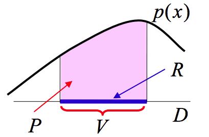
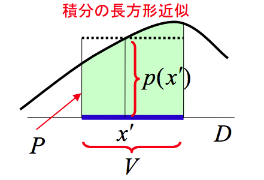
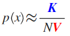
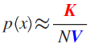

# 確率密度分布の推定

---
## パラメトリックモデル
> パラメトリックな手法は、母集団の確率密度分布を仮定するものをいう
### 最尤法

### ベイズ推定

---
## ノンパラメトリックモデル
> ノンパラメトリック(non-parametric)な手法はパラメータ(母数: 母集団を規定する量)について一切の前提を設けないものをいう

あるベクトル$x$が未知の確率密度関数$p\left(x\right)$からのサンプルであるとする。このベクトル$x$がある領域$R$の内側に入る確率$P$は、

$$
P\left( { R }_{ L }\le x\le { R }_{ H } \right) =\int _{ { R }_{ L } }^{ { R }_{ H } }{ p\left( x \right) dx } \\ P=\int _{ R }{ p\left( x \right) dx }
$$

で与えられる。

 - $R$: $x_{0}$を含むパターン空間$D$内のある領域(region)
 - $V$: $R$の体積(volume)
 - $P$: $x$が$R$に入る確率

このとき、確率$P$を二つの方法で近似する。

1)領域$R$内での確率密度関数がほぼ一定の場合の$P$は
$$
P \approx p\left(x\right) \cdot V
$$
と近似できる。

2)独立なサンプル$N$個のうち、$K$個が領域$R$に入る確率$P$は、二項分布の定義から
$$
Pr\left(K\right) = { _{ N }{ C }_{ K } }P^{K}(1-P)^{N-K}
$$
で与えられるある。(二項分布: *確率$P$をもつ事象が$N$回の観察中$K$回起こる確率*) 
ベクトル$x$がこの領域$R$にある平均割合は
$$
E\left[ \frac { K }{ N }  \right] =\frac { E\left[ K \right]  }{ N } =\frac { NP }{ N } =P
$$
分散は
$$
V\left[ \frac {K}{N} \right] = \frac {V\left[ NP(1-P) \right]}{N^{2}} = \frac {P(1-P)}{N}
$$
となり、$N$が十分に大きいとき、$V\left[ \frac {K}{N} \right] \rightarrow 0$となる。そのため、$E\left[ \frac {K}{N} \right]$は確率$P$の不偏性・有効性を満たす良い推定値である。

$$
P \approx \frac {K}{N}
$$

1)と2)の結果から、確率密度関数は、

$$
p\left(x\right) \cdot V \approx \frac {K}{N}\\
p\left(x\right) \approx \frac {K}{NV}
$$

のように推定できることがわかる。

※注意！！:このような近似が成り立つためには、次のようなことを満足するように領域$R$を選ばなければならない

 - 領域$R$内で確率密度関数$p\left(x\right)$があまり変化しない(1)を参照)ためには、領域$R$は十分小さくなければならない
 - 一方、二項分布が推定値$\frac {K}{N}$周辺で鋭いピークを持つためには(分散が0に近づくには)、領域$R$に入るサンプル数が十分多くなければならないので、領域$R$はある程度大きくなければならない

### カーネル密度推定法(Kernel density estimation)
> $R$の形を決め、$V$を固定したもとで$K$を標本から決定
>
> 

今、領域$R$として、点$x$を中心とする辺の長さが$h$の超立方体を考える。このとき、領域$R$の体積は、
$$
V = h^{D}
$$
となる。原点を中心とする辺の長さが$1$の超立方体は、カーネル関数
$$
K\left( u \right) =\begin{cases} 1\qquad \left| { u }_{ j } \right| <\cfrac { 1 }{ 2 } \quad j=1,\dots D \\ 0\qquad otherwise \end{cases}
$$
を用いて表すことができる。

 - $h$: バンド幅(平滑化パラメータ)
 - $K\left(u\right)$: カーネル関数
 - $D$: ベクトル$x$の次元数

 - **Parzenの窓関数(Parzen window)**を用いたカーネル密度推定

$$
\hat { p } \left( x \right) =\frac { 1 }{ N } \sum _{ i=1 }^{ N }{ \frac { 1 }{ { h }^{ D } } K\left( \cfrac { x-{ x }_{ i } }{ h }  \right)  }
$$

ただし、Parzen の窓関数を用いた推定法では推定された密度分布は滑らかでは無い。これを滑らかにするためには、カーネル関数として滑らかなものを利用する必要がある。滑らかなカーネル関数として、一般に、多変量正規分布に基づくカーネル関数が良く用いられる。この場合には、求めたい確率密度分布$\hat{p}\left(x\right)$は、
$$
\hat { p } \left( x \right) =\frac { 1 }{ N } \sum _{ i=1 }^{ N }{ \frac { 1 }{ \sqrt { { \left( 2\pi { h }^{ 2 } \right)  }^{ D } }  } exp\left\{ -\frac { { \left| x-\mu  \right|  }^{ 2 } }{ 2{ h }^{ 2 } }  \right\}  }
$$
のように推定される。また、平均が$0$で分散が$1$の標準正規分布を用いることも多い。
$$
\hat { p } \left( x \right) =\frac { 1 }{ N } \sum _{ i=1 }^{ N }{ \frac { 1 }{ \sqrt { { \left( 2\pi  \right)  }^{ D } }  } { e }^{ -\frac { { x }^{ 2 } }{ 2 }  } }
$$

### K近傍法(k-nearest neighbor density estimation)
> $R$の形を決め、$K$を固定したもとで$V$を標本から決定
>
> 

ノンパラメトリックモデルの参考文献

 - [2.5章　ノンパラメトリック - Qiita](https://qiita.com/donmai/items/c3a5adaf1cbab4512ccb#%E3%82%AB%E3%83%BC%E3%83%8D%E3%83%AB%E9%96%A2%E6%95%B0%E3%81%AE%E4%B8%80%E4%BE%8B)
 - [情報認識「最近傍密度推定法（第１３章）」](./pdf/確率密度推定(ノンパラメトリック\)\.pdf)
 - [カーネル密度推定 - Wikipedia](https://ja.wikipedia.org/wiki/%E3%82%AB%E3%83%BC%E3%83%8D%E3%83%AB%E5%AF%86%E5%BA%A6%E6%8E%A8%E5%AE%9A)

---
## セミパラメトリックモデル

---
全体の参考文献

 - [確率密度分布の推定](http://home.hiroshima-u.ac.jp/tkurita/lecture/prnn/node5.html)
