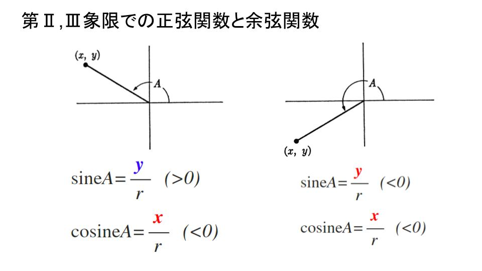
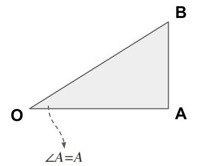
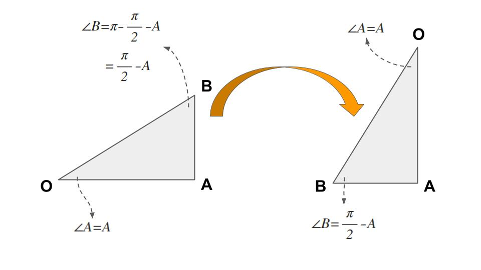
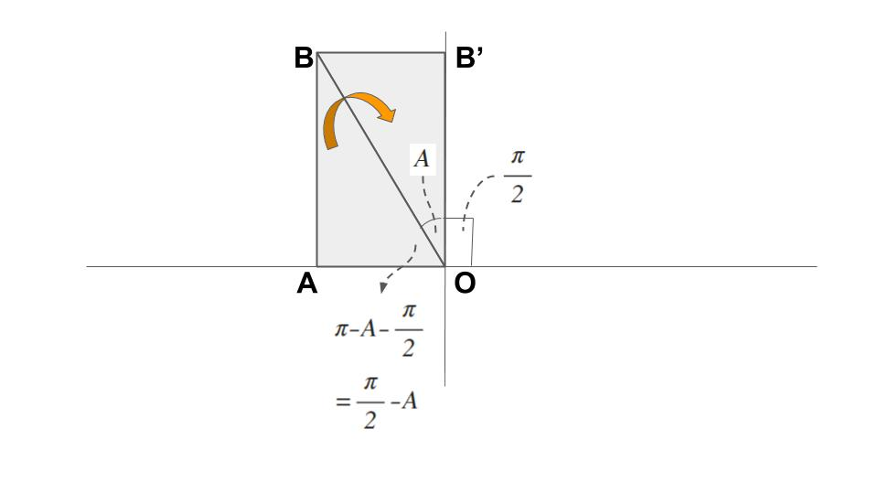
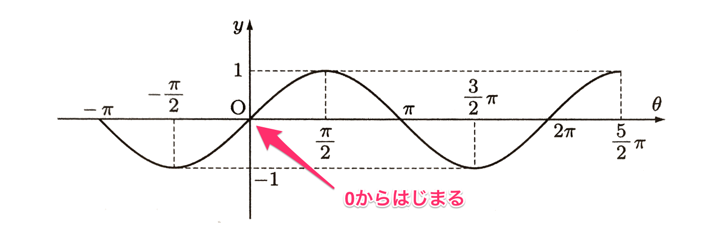
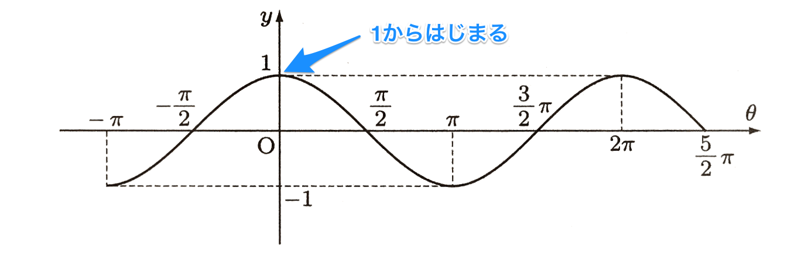
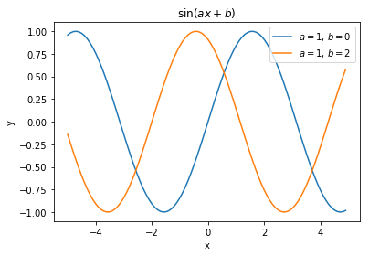
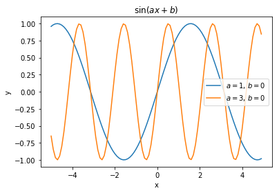
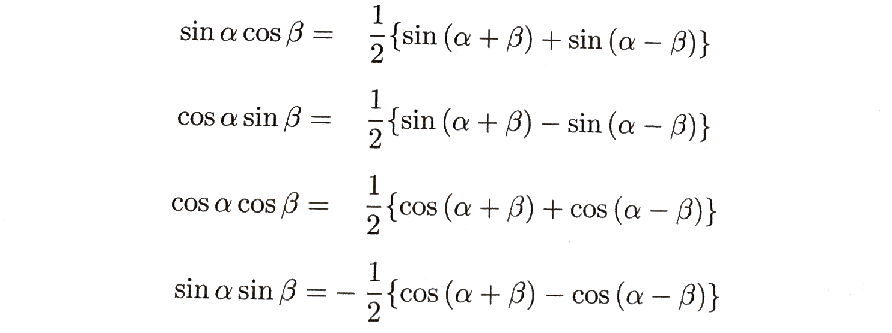
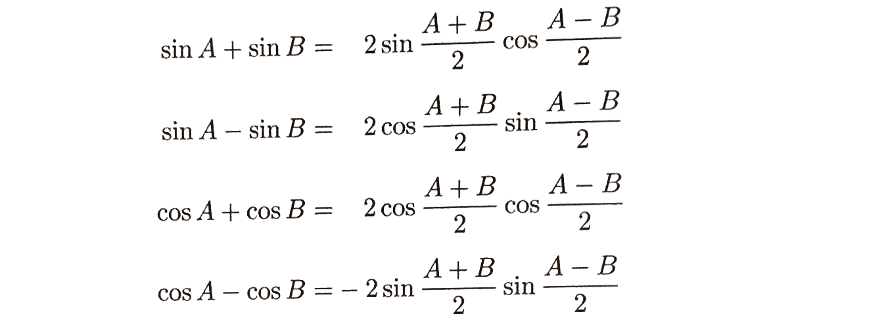

# 三角関数
　
　三角形の辺と角の性質は、測量・天体観測・航海術などに広く利用された。また、近年では振動を伴う現象の研究や調和解析・時系列データの解析にも用いられるようになり、科学技術に大きく貢献した。 
　本ドキュメントでは、'角'の「正弦」および「余弦」からはじめて、'数'の正弦関数および余弦関数を定義し、さらにそれらの導関数を求める。

## 1. 正弦関数および余弦関数
### 1.1. '角'の「正弦」および「余弦」
次の図に示すように、座標軸およびある角が与えられたとする。

角Aを定める直線上に(原点以外の)点 $\left( x, y \right)$ をとり、$r = \sqrt {x^{2} + y^{2}}$ (ユークリッド距離)とする。r は原点 $\left( 0, 0 \right)$ から点 $\left( x,y \right)$ への距離である。このとき、

$$
\mathrm{ sine } {A} = \frac {y}{r} = \frac { y }{ \sqrt {x^{2} + y^{2}} }\\
\mathrm{ cosine } {A} = \frac {x}{r} = \frac { x }{ \sqrt {x^{2} + y^{2}} }
$$

と定義する。$\mathrm {sine} A$, $\mathrm {cosine} A$ をそれぞれ角Aの「正弦」、「余弦」という。

角Aは原点のまわり全体をまわることができる。たとえば、第Ⅱあるいは第Ⅲ象限に点 $\left( x,y \right)$ を定めて、それぞれ1つの角を得ることができる。

なお、正弦・余弦の分母のrは常に正であることに注意すること。

 - 角Aが第**Ⅰ**象限にあるとき : $x,y$ はともに正であるから、その「正弦」、「余弦」はともに正
 - 角Aが第**Ⅱ**象限にあるとき : $y$ は正であるから「正弦」は正である。しかし、$x$ は負であるから「余弦」は負
 - 角Aが第**Ⅲ**象限にあるとき : $\mathrm{ sine } {A}$,$\mathrm{ cosine } {A}$もともに負

### 1.2. ラジアンと度の定義
　次に'数'の正弦を定義するために、角を測る単位を定めよう。ここで、半径1の円を考える。
この半径1の円の面積は
$$
1^{2} \times \pi = \pi
$$
である。そのとき単位の角を、平角($ = 180° $)が単位角の $\pi$ 倍になるように選ぶ。このとき直角は $\pi / 2$ で与えられ、点のまわりを一周した角は $2 \pi$ で与えられる。

平角が $\pi$ となるように選んだ角の単位を**ラジアン**という。したがって、直角は $\pi / 2$ ラジアンである。

　他に平角が180であるように選んだ角の単位がある。この単位は**度**と呼ばれる。それゆえ平角は180**度**、直角は90**度**である。また次の関係が成り立つ:

	$360$度 = $2 \pi$ラジアン 
	$60$度 = $\pi / 3$ラジアン 
	$45$度 = $\pi / 4$ラジアン 
	$30$度 = $\pi / 6$ラジアン

これらの角の「正弦」と「余弦」の表をつくってみよう。

以下、特に断りのない限り、"角を測る単位としてはラジアンを用いる"。上の表はこの単位を用いて書かれている。

### 1.3. 定理

> #### 定理1
> 任意の角Aに対して
> $$
\mathrm {sine} A = \mathrm {cosine}\left( A - \frac {\pi}{2} \right)
$$
> あるいは
> $$
\mathrm {cosine} A = \mathrm {sine}\left( A + \frac {\pi}{2} \right)
$$
> が成り立つ。

証明:
角 $A$ の鋭角な三角形を仮定する。

この三角形のコサインは定義より

$$
\mathrm {cosine} {A} = \frac {OA}{OB}
$$

である。このとき、角$B$は

$$
\angle B = \pi - \left( \frac {\pi}{2} + A \right)\\
= \frac {\pi}{2} - A
$$

であり、角$B$の鋭角な三角形のサインは

$$
\mathrm {sine}\left( \frac {\pi}{2} - A \right) = \frac {OA}{OB}
$$

となる。よって、任意の角Aに対して

$$
\mathrm {sine} A = \mathrm {cosine}\left( A - \frac {\pi}{2} \right)
$$

となる。

　次に $\mathrm {cosine} A = \mathrm {sine}\left( A + \frac {\pi}{2} \right)$ を証明する。これは、ラジアンが$\frac {\pi}{2} + A$ の正弦が
$$
\mathrm {sine}\left( A + \frac {\pi}{2} \right) = \frac {AB}{OB}
$$
であり、余弦が

$$
\mathrm {cosine}\left( A \right) = \frac {OB'}{OB}\\
\qquad = \frac {AB}{OB} \quad (OB' = AB)
$$
であることで証明できる。

### 1.4. '数'の正弦および余弦
さてここで、我々は、これもまた**正弦**と呼ばれる'数の関数'を定義しよう。それは、次の規則によって定義される関数である。

> "*任意の数 $x$ に、$x$ ラジアンの「正弦」の値を対応づける*"

この関数は、$\sin {x}$ と書かれる。(それゆえ、$\sin {x} = \mathrm{sine} {(xラジアン)}$ である。)それは、すべての数$x$に対して定義され、例えば、$\sin {\pi} = 0$, $\sin {\pi / 2} = 1$, $\sin {2 \pi} = 0$, $\sin {0} = 0$となる。

同様に**余弦**関数も定義される。それはすべての $x$ に対して定義され、その規則は次のようにいい表せる。

> "*$\cos {x}$ は $x$ ラジアンの大きさの角の「余弦」である*"

それゆえ、例えば $\cos {0} = 1$, $\cos {\pi} = -1$ である。

さらに**正接**関数 $\tan {x}$ を、商

$$
\tan {x} = \frac { \sin {x} }{ \cos {x} }
$$

により定義することができる。これは $\cos {x} \neq 0$ であるようなすべての $x$ に対して定義される。

角の単位として度を用いれば、'別の'正弦関数を得る。

度を用いて定義された正弦関数を $\sin^{\ast}$ と書くことにしよう。そのとき、
$$
\sin^{\ast}\left( 180 \right) = \sin {\pi}
$$
である。一般に任意の数 $x$ に対して
$$
\sin^{\ast}\left( 180 x \right) = \sin {\pi x}
$$
が成り立つ。それゆえ、2つの正弦関数を結びつける式として

$$
\sin^{\ast} {x} = \sin {\left( \frac {\pi}{180} x \right)}
$$

を得る。

任意の$x$の値に対する$\sin {x}$および$\cos {x}$の値を、必要とするだけ正確に求める方法としてテイラー展開がある。

> #### 定理2
> $$
\left( \sin {x} \right)^{2} + \left( \cos {x} \right)^{2} = 1\\
\left( \tan {x} \right)^{2} + 1 = \frac {1}{\left( \cos {x} \right)^{2}}
$$

 

> #### 定理3
> $$
\sin {\left( - x \right)} = - \sin {x}\\
\cos {\left( - x \right)} = \cos {x}
$$

## 2. グラフ
三角関数には、**周期性**と**対称性**がある。

### 2.1. 正弦関数
$$
y = \sin {x}
$$

 - 定義域 : 実数全体
 - 値域 : $ -1 \le y \le 1$

### 2.2. 余弦関数
$$
y = \cos {x}
$$

 - 定義域 : 実数全体
 - 値域 : $ -1 \le y \le 1$

### 2.3. 周期関数
 $x$が$2 n \pi$だけ動けば、正弦関数および余弦関数はともに同じ値にもどる。すなわち、すべての$x$に対して

$$
\sin {\left( x \pm  2 n \pi \right)} = \sin {x}\\
\cos {\left( x \pm  2 n \pi \right)} = \cos {x}\\
$$

が成り立つ。一般に、関数$f\left( x \right)$について、$x$のすべての値に対して

$$
f\left( x + p \right) = f\left( x \right)
$$

が成り立つような0でない定数$p$があるとき、$f\left( x \right)$は**周期関数**といい、この性質をもつ正の最小の数$p$を**周期**という。周期関数のグラフは$x$軸方向に$p$だけ平行移動するともとのグラフと一致する。

また、正弦関数・余弦関数を一般化すると

$$
y = \sin {\left( \alpha x + \lambda \right)}\\
y = \cos {\left( \alpha x + \lambda \right)}
$$

 - $\lambda$ : グラフのずれ
 - $\alpha$ : 周期間隔

	

$\lambda$の値を2とした場合、$x = -2$のときに$y = 0$となる。つまり、周期が$\mp \lambda$だけずれる。

	

$\alpha = 2$とした場合、周期の間隔が縮まった。

## 3. 公式
 この節では、正弦および余弦に関する最も重要な公式を述べ、かつそれを証明する。

 

> #### 加法定理
> 角$\alpha, \beta$に対して
> 

 

> #### 倍角の公式
> 

 

> #### 積を和になおす公式
> 

> このうち第1式と第2式は$\alpha$と$\beta$を入れ替えただけの式である。

 

> #### 和と差を積になおす公式
> 「積を和になおす公式」から
> $$
\alpha + \beta = A, \quad \alpha - \beta = B
$$
> とおけば、
> $$
\alpha = \frac {A + B}{2}, \quad \beta = \frac {A - B}{2}
$$
> となり、次の公式をえる。

> 

## 4. 導関数
正弦関数および余弦関数は導関数をもち、
$$
\frac {d(\sin {x})}{dx} = \cos {x}\\
\frac {d(\cos {x})}{dx} = - \sin {x}\\
$$
となる。
