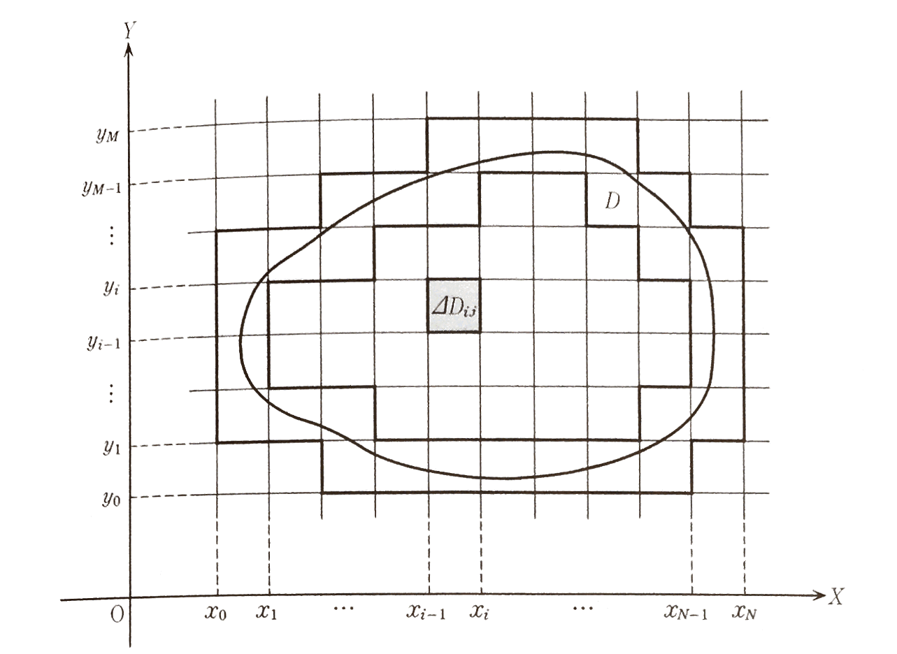
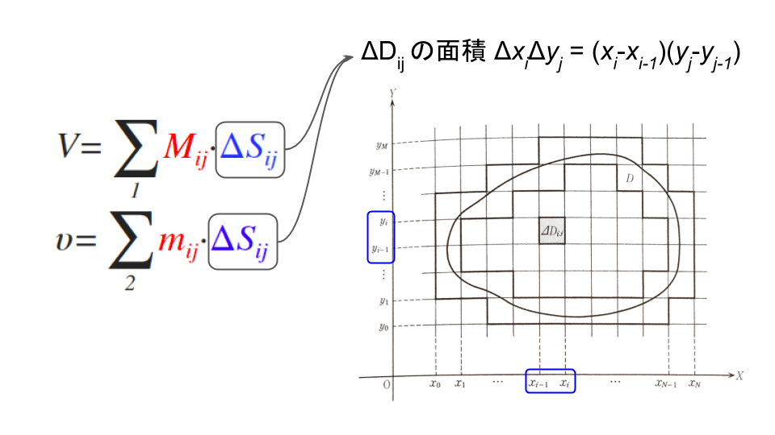
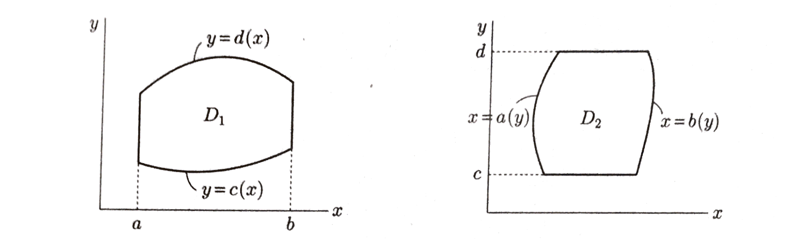

# 多重積分
## イメージ
　下の図のように、$XY$平面上有界な領域$D$で定義されている2変数関数 $z = f\left( x, y \right)$ について、和

$$
V = \sum _{1}{M_{ij} \Delta S_{ij}}\\
\upsilon = \sum _{2}{ m_{ij} \Delta S_{ij} }
$$

を考えよう。

|   |   |
|:-:|:-:|
|  |  |

ただし、各変数の意味は以下の通りである。

|    |
|:--:|
|  | 
|  |
|  |

つまり、$V, \upsilon$はそれぞれ、上方積分・下方積分を表している。

なお、$\Delta D_{ij}$の中のある点を $\left( \xi_{ij}, \eta_{ij} \right)$ と書いたとき、定積分同様

$$
\sum _{1 or 2}{ f\left( \xi_{ij}, \eta_{ij} \right) \Delta S_{ij} }
$$

でリーマン和が定義されるが、その値は $\upsilon$ と $V$ の間に存在する。

格子をどんどん細くする、すなわち、$\Delta x_{1}, \Delta x_{2}, \cdots, \Delta x_{N}, \Delta y_{1}, \Delta y_{2}, \cdots, \Delta y_{M}$ の最大値$\Delta$を0に近づける。このとき、$V$と$\upsilon$の極限が存在し一致すれば、そん値は関数$f\left( x, y \right)$のグラフと底面$D$との間の立体の体積に等しくなり、それを$\iint _{ D }{ f\left( x,y \right) dS }$と書く。すなわち、

$$
\iint _{ D }{ f\left( x,y \right) dS } =\lim _{ \Delta \rightarrow 0 }{ V } =\lim _{ \Delta \rightarrow 0 }{ \upsilon  } 
$$

この積分を領域$D$における関数$f\left( x, y \right)$の**2重積分**といい、$\iint _{ D }{ f\left( x,y \right) dxdy }$と書くこともある。また、誤解のないときには、$\iint _{ D }$の代わりに$\int _{ D }$と書いてもよい。なお、$dS = dxdy$を**面積要素**という。

---
## 多重積分の基本的性質
### 線形性
$a$と$b$を定数とする。
$$
\iint _{D}{\left\{ a f\left( x, y \right) + b g\left( x, y \right) \right\} dxdy}\\
= a \iint _{D}{ f\left( x, y \right) dxdy } + b\iint _{D}{g\left( x,y \right) dxdy}
$$

### 領域の分割
$D$が2つの領域$D_{1}, D_{2}$に分割されているとする。
$$
\iint _{D}{f\left( x,y \right)dxdy} = \iint _{D_{1}}{ f\left( x,y \right) dxdy } + \iint _{D_{2}}{ f\left( x,y \right) dxdy }
$$

---
## 多重積分の計算方法
多重積分は積分しやすい変数から順に1変数関数の定積分を繰り返し行うという**累次積分**の方法を用いればよい。特に、短形領域の場合には次のような性質がある。

> ### 短形領域での重積分の性質
> $D = \left[ a , b \right] \times \left[ c,d \right]$とする。

> (1) 次式が成り立つ。
> $$
\iint _{ D }{ f\left( x,y \right) dxdy } =\int _{ a }^{ b }{ \left\{ \int _{ c }^{ d }{ f\left( x,y \right) dy }  \right\} dx } \\ \qquad \qquad \qquad  =\int _{ c }^{ d }{ \left\{ \int _{ a }^{ b }{ f\left( x,y \right) dx }  \right\} dy } 
$$
> (2) $f\left(x,y\right) = g\left(x\right)h\left(y\right)$と表すことができるとき、次式が成り立つ。
> $$
\iint _{ D }{ f\left( x,y \right) dxdy } = \left( \int _{a}^{b}{ g\left(x\right) dx } \right)\left( \int _{c}^{d}{ h\left(x\right) dy } \right)
$$

 

### 変数に依存する積分領域での重積分
積分領域が下の図のように$x$や$y$に依存する場合の重積分を考える。

この場合には、次のように重積分を計算する。

>$D_{1} = \left\{ \left( x,y \right) : a \le x \le b, c\left( x \right) 
\le y \le d\left( x \right) \right\}$とする。
>
> $$
\iint _{ D_{ 1 } }{ f\left( x,y \right) dxdy } =\int _{ a }^{ b }{ \left\{ \int _{ c\left( x \right)  }^{ d\left( x \right)  }{ f\left( x,y \right)  } dy \right\} dx } 
$$

> $D_{2} = \left\{ \left( x,y \right) : a\left( y \right) \le x \le b\left( y \right), c \le y \le d \right\}$とする。
> $$
\iint _{ D_{ 2 } }{ f\left( x,y \right) dxdy } =\int _{ c }^{ d }{ \left\{ \int _{ a\left( y \right)  }^{ b\left( y \right)  }{ f\left( x,y \right)  } dx \right\} dy } 
$$
